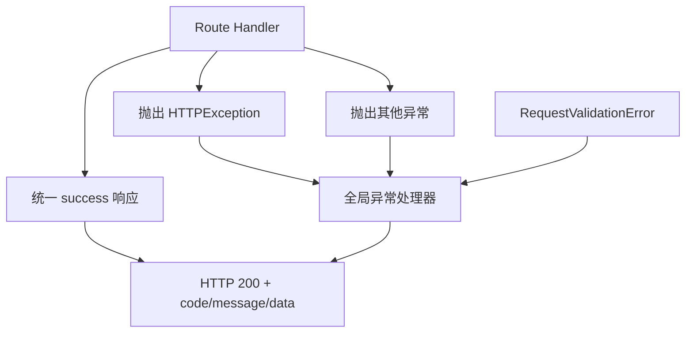

# 变更提案: api-unified-response

## 元信息
```yaml
类型: 重构
方案类型: implementation
优先级: P1
状态: 已确认
创建: 2026-04-22
```

---

## 1. 需求

### 背景
当前 FastAPI 接口直接返回业务对象，错误场景依赖 HTTP 状态码与 `HTTPException.detail` 表达结果。这种模式对前端或调用方并不稳定：

- 成功响应与错误响应结构不统一，调用方需要区分 HTTP 状态码和 JSON 结构。
- 业务方希望所有接口 HTTP 层都返回 `200`，业务状态通过响应体中的 `code/message/data` 统一表达。
- 现有“租户不存在时初始化飞书失败”的场景已经从隐式创建改为报错，但返回形式仍是 HTTP `404`，不符合新的接口契约。

### 目标
- 为现有 API 引入统一响应包裹结构：`{"code": int, "message": str, "data": any}`。
- 保持所有接口的 HTTP 状态码固定为 `200`。
- 将业务异常、运行时异常、参数校验异常统一收敛到同一 JSON 响应结构。
- 保持现有业务逻辑不变，仅调整 API 出参与异常表达方式。

### 约束条件
```yaml
时间约束: 本轮在现有 app 层内完成，不扩展到 workflow 核心执行链
性能约束: 仅增加轻量响应包装，不引入额外 IO
兼容性约束: 现有路由路径、请求参数与业务处理逻辑保持不变
业务约束: 所有接口 HTTP 状态码固定为 200，业务状态放入 JSON code 字段
```

### 验收标准
- [ ] 所有现有 API 成功响应都返回统一结构，且最外层包含 `code/message/data`。
- [ ] 路由中抛出的 `HTTPException` 会被统一转换为 HTTP 200 + 业务 `code`。
- [ ] FastAPI/Pydantic 参数校验错误会被统一转换为 HTTP 200 + 业务 `code`，响应结构与其他错误一致。
- [ ] “租户不存在时初始化飞书”返回 `{"code": 404, "message": "tenant not found", "data": ""}`。
- [ ] 自动化测试覆盖成功、业务错误、参数校验错误至少各一类场景。

---

## 2. 方案

### 技术方案
采用“响应模型 + 全局异常处理 + 路由统一返回”的单方案实现：

1. 在 `app/schemas.py` 中新增通用 API 响应模型，提供统一的成功响应和失败响应结构。
2. 在 `app/main.py` 注册全局异常处理器，拦截：
   - `HTTPException`
   - `RequestValidationError`
   - 兜底 `Exception`
3. 在 `app/routes.py` 中把成功返回包装成统一结构；保留原有业务判断，但异常改由全局处理器统一输出。
4. 在 `tests/` 中新增/更新接口测试，验证成功、租户不存在、参数缺失等场景都返回 HTTP 200 且 JSON 结构一致。

### 影响范围
```yaml
涉及模块:
  - app: 新增统一响应结构、异常处理注册、路由返回包装
  - tests: 更新接口测试断言为统一返回结构
预计变更文件: 4-6
```

### 风险评估
| 风险 | 等级 | 应对 |
|------|------|------|
| 调用方已依赖原始返回结构 | 中 | 统一更新接口测试，并在变更记录中明确响应契约已调整 |
| FastAPI 默认 422 被遗漏，导致返回风格不一致 | 中 | 增加 `RequestValidationError` 全局处理器并补测试 |
| 路由成功返回改造不完整 | 中 | 用接口级测试覆盖关键成功接口与错误接口 |

---

## 3. 技术设计（可选）

> 涉及架构变更、API设计、数据模型变更时填写

### 架构设计


### API设计
#### 所有现有 API
- **请求**: 保持现有请求模型不变
- **成功响应**:
  ```json
  {
    "code": 0,
    "message": "ok",
    "data": {}
  }
  ```
- **失败响应**:
  ```json
  {
    "code": 404,
    "message": "tenant not found",
    "data": ""
  }
  ```
- **HTTP 状态码**: 固定 `200`

### 数据模型
| 字段 | 类型 | 说明 |
|------|------|------|
| code | int | 业务状态码，0 表示成功，其余表示业务或系统错误 |
| message | str | 响应说明 |
| data | Any | 成功时返回业务数据，失败时返回空字符串或空对象 |

---

## 4. 核心场景

> 执行完成后同步到对应模块文档

### 场景: 初始化飞书时租户不存在
**模块**: app
**条件**: 调用 `PUT /tenants/{tenant_id}/feishu`，且租户不存在
**行为**: 路由抛出“tenant not found”业务异常
**结果**: HTTP 200，响应体为 `{"code": 404, "message": "tenant not found", "data": ""}`

### 场景: 查询租户列表成功
**模块**: app
**条件**: 调用 `GET /tenants`
**行为**: 路由返回租户列表
**结果**: HTTP 200，响应体为 `{"code": 0, "message": "ok", "data": {"tenants": [...]}}`

### 场景: 请求参数缺失
**模块**: app
**条件**: 调用需要请求体的接口但缺少必填字段
**行为**: FastAPI 触发参数校验异常
**结果**: HTTP 200，响应体为统一错误结构，`code` 为 422

---

## 5. 技术决策

> 本方案涉及的技术决策，归档后成为决策的唯一完整记录

### api-unified-response#D001: API 统一使用 HTTP 200 承载业务状态
**日期**: 2026-04-22
**状态**: ✅采纳
**背景**: 调用方要求不再依赖 HTTP 状态码区分成功/失败，而是统一读取 JSON 中的 `code/message/data`。
**选项分析**:
| 选项 | 优点 | 缺点 |
|------|------|------|
| A: 保持 HTTP 状态码表达错误 | 符合默认 REST 习惯，实现简单 | 不符合当前调用方契约，错误处理分散 |
| B: HTTP 固定 200，业务状态写入响应体 | 前后端协议统一，调用方处理简单 | 偏离默认 REST 约定，需要统一异常处理 |
**决策**: 选择方案 B
**理由**: 当前需求明确要求所有 JSON 返回都通过 `code/message/data` 表达业务结果，因此需要让成功和失败都走同一种返回结构。
**影响**: 影响 `app/main.py`、`app/routes.py`、`app/schemas.py` 与接口测试断言。

### api-unified-response#D002: 通过全局异常处理器统一错误响应
**日期**: 2026-04-22
**状态**: ✅采纳
**背景**: 如果逐个路由手工包装错误，会导致实现重复且容易遗漏 `HTTPException`、`RequestValidationError` 等不同来源的异常。
**选项分析**:
| 选项 | 优点 | 缺点 |
|------|------|------|
| A: 每个路由手工 try/except 后返回统一 JSON | 显式直接 | 重复代码多，容易漏掉校验异常 |
| B: 在 FastAPI 应用层注册全局异常处理器 | 实现集中，覆盖面完整，后续扩展容易 | 需要补齐异常映射逻辑 |
**决策**: 选择方案 B
**理由**: 统一错误出参属于应用层横切能力，最合理的落点是全局异常处理器，而不是散落在各路由中。
**影响**: 主要影响 `app/main.py` 的应用初始化和错误处理流程。

---

## 6. 成果设计

本次为非视觉接口契约改造任务，N/A。
