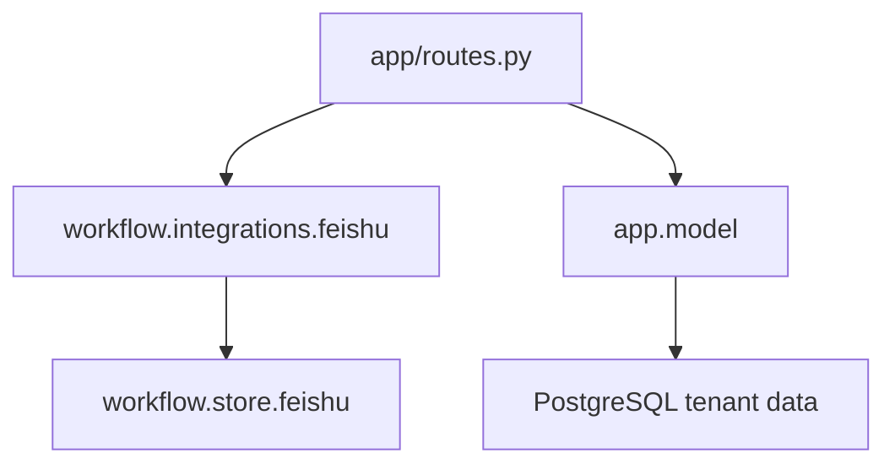

# 变更提案: feishu-integration-extract

## 元信息
```yaml
类型: 重构
方案类型: implementation
优先级: P1
状态: 已确认
创建: 2026-04-22
```

---

## 1. 需求

### 背景
`app/model.py` 当前同时承载两类职责：

- 租户与飞书配置的 PostgreSQL 数据操作
- 飞书链接解析、凭证校验、表格/文档远程探测、远程配置构建

这导致 `model` 的边界过宽，不再只表示“数据相关操作”。用户已经明确希望 `model` 只保留数据结构和数据读写，而飞书共享能力应迁移到 `workflow/integrations`。

### 目标
- 将 `app/model.py` 中飞书共享集成逻辑迁移到 `workflow/integrations/feishu.py`。
- 保证 `app/model.py` 只保留租户数据结构、PostgreSQL 初始化和租户配置读写。
- 更新 `app/routes.py` 与测试引用，保持现有行为不变。
- 让 `workflow/integrations` 成为可复用的飞书集成适配层。

### 约束条件
```yaml
时间约束: 本轮完成文件拆分、导入更新和回归验证
性能约束: 仅重组代码位置，不改变飞书 API 调用流程
兼容性约束: 路由行为、响应结构与已有测试语义保持一致
业务约束: build_feishu_config_payload() 与飞书远程配置构建逻辑一并迁移到共享集成层
```

### 验收标准
- [ ] `app/model.py` 中不再包含飞书解析、飞书 API 调用和远程配置构建逻辑。
- [ ] 新增 `workflow/integrations/feishu.py` 承接飞书共享集成能力。
- [ ] `app/routes.py` 能正常从共享集成层导入所需飞书能力。
- [ ] 相关单元测试通过，且不改变现有接口行为。

---

## 2. 方案

### 技术方案
采用“集成层抽离 + model 收敛”的单方案重构：

1. 新建 `workflow/integrations/feishu.py`，迁移飞书共享能力，包括：
   - payload 构建
   - 飞书 store 构造
   - 凭证校验
   - bitable 链接解析与表格读取
   - docx/wiki 链接解析与文档解析
   - `build_remote_feishu_config()`
2. 更新 `workflow/integrations/__init__.py` 导出飞书共享能力。
3. 收敛 `app/model.py`，保留：
   - `Tenant` / `TenantFeishuConfig`
   - PostgreSQL 连接与表初始化
   - 租户与租户飞书配置 CRUD
   - `get_feishu_runtime_config()`
4. 更新 `app/routes.py` 和测试导入，确保接口行为与当前实现保持一致。

### 影响范围
```yaml
涉及模块:
  - app: model 仅保留数据职责，routes 改为依赖 integrations.feishu
  - workflow/integrations: 新增 feishu 共享集成模块并更新导出
  - tests: 更新测试导入路径，验证行为不回归
预计变更文件: 5-7
```

### 风险评估
| 风险 | 等级 | 应对 |
|------|------|------|
| 迁移后导入路径遗漏导致运行时报错 | 中 | 使用 `rg` 检查调用点并跑针对性测试 |
| `app/model.py` 仍残留飞书集成依赖 | 低 | 迁移后重新检查 imports 与函数边界 |
| `workflow/integrations` 导出不完整，后续复用不便 | 低 | 同步更新 `__init__.py` 暴露飞书能力 |

---

## 3. 技术设计（可选）

### 架构设计


### API设计
#### 代码内模块边界
- **`app.model`**: 仅提供数据结构与数据库读写
- **`workflow.integrations.feishu`**: 提供飞书解析、校验、远程配置构建
- **`app.routes`**: 组合调用 `app.model` 与 `workflow.integrations.feishu`

### 数据模型
| 字段 | 类型 | 说明 |
|------|------|------|
| Tenant | dataclass | 租户基础数据结构 |
| TenantFeishuConfig | dataclass | 租户飞书配置数据结构 |
| remote_feishu_config | dict[str, Any] | 飞书远程配置构建结果 |

---

## 4. 核心场景

### 场景: 管理后台初始化飞书配置
**模块**: app / workflow.integrations
**条件**: 调用 `PUT /tenants/{tenant_id}/feishu`
**行为**: 路由通过共享飞书集成层解析链接、校验凭证并构建远程配置，再写入数据库
**结果**: 路由行为不变，但 `model` 不再承担飞书集成职责

### 场景: 其他模块复用飞书集成能力
**模块**: workflow.integrations
**条件**: 后续 workflow 或其他模块需要飞书解析/校验能力
**行为**: 直接从 `workflow.integrations.feishu` 导入
**结果**: 不需要再依赖 `app.model`

---

## 5. 技术决策

### feishu-integration-extract#D001: 飞书共享能力迁移到 workflow/integrations
**日期**: 2026-04-22
**状态**: ✅采纳
**背景**: 用户明确要求 `model` 只保留数据相关操作，而飞书解析与远程调用逻辑属于共享集成能力。
**选项分析**:
| 选项 | 优点 | 缺点 |
|------|------|------|
| A: 继续放在 `app/model.py` | 调整最少 | 边界混乱，model 不再只负责数据 |
| B: 迁到 `workflow/integrations/feishu.py` | 职责清晰，可被共享复用 | 需要同步调整导入 |
**决策**: 选择方案 B
**理由**: 飞书相关逻辑本质上是第三方系统适配层，放在共享集成目录比继续堆在 model 中更符合项目分层。
**影响**: 影响 `app/model.py`、`app/routes.py`、`workflow/integrations/__init__.py` 与测试导入。

---

## 6. 成果设计

本次为非视觉重构任务，N/A。
