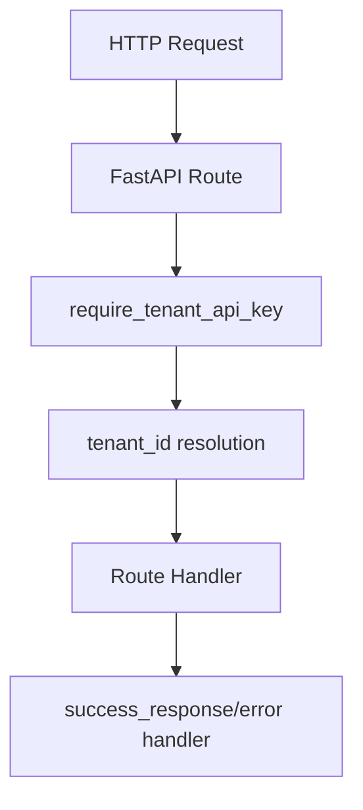

# 变更提案: sync-api-md-interfaces

## 元信息
```yaml
类型: 优化
方案类型: implementation
优先级: P1
状态: 已规划
创建: 2026-04-23
```

---

## 1. 需求

### 背景
仓库根目录 `api.md` 已定义当前 HTTP API 的鉴权方式、统一返回结构和不带租户路径的推荐调用方式。用户补充确认不需要兼容路径，接口不应继续暴露路径中携带 `tenant_id` 的老接口。

### 目标
- 以 `api.md` 为唯一接口规范，逐项同步 REST API 实现。
- 确保所有成功和失败响应均使用 HTTP 200 + `code/message/data` 结构。
- 确保受保护接口统一使用 `X-API-Key` 反查租户，推荐路径不要求显式传 `tenant_id`。
- 移除显式 `tenant_id` 老路径，客户端统一通过 `X-API-Key` 识别当前租户。
- 补充或调整测试，覆盖鉴权、推荐路径、请求体 tenant 不匹配和错误返回。

### 约束条件
```yaml
时间约束: 无
性能约束: 不引入额外远程调用；仅复用现有数据库与运行时能力
兼容性约束: 不保留路径携带 tenant_id 的老接口
业务约束: api.md 为接口 SSOT；代码行为与文档冲突时以文档为准
```

### 验收标准
- [ ] `GET /api/health`、`GET /api/tenants`、`POST /api/tenants` 可免鉴权。
- [ ] 其余受保护接口缺少或传入无效 `X-API-Key` 时返回 HTTP 200，业务码分别为 401。
- [ ] 请求体显式 `tenant_id` 与 API key 绑定租户不一致时返回 HTTP 200，业务码为 403。
- [ ] 推荐路径 `/api/tables`、`/api/schedules`、`/api/flows/{flow_id}/runs/{batch_id}`、`/resume` 等均按当前租户执行。
- [ ] 路径中携带 `tenant_id` 的 run 查询/恢复接口不再注册。
- [ ] 相关测试或最小验证通过。

---

## 2. 方案

### 技术方案
采用最小改动方式对齐接口规范：
- 复核 `app/routes.py` 中公开路由，补齐 api.md 声明但代码缺失或行为不一致的路径。
- 复核 `app/dependencies.py` 中 `require_tenant_api_key` 的租户解析与不匹配校验，确保请求体、路径和 query 中显式 `tenant_id` 均受约束。
- 复核 `app/schemas.py` 中请求和响应模型，确保文档中请求体字段可被正确接受。
- 补充 API 层测试，优先使用 FastAPI `TestClient` 并 mock 数据库/运行时依赖，避免依赖真实 PostgreSQL。
- 同步更新 `.helloagents/modules/app.md` 和 CHANGELOG，记录接口行为变化。

### 影响范围
```yaml
涉及模块:
  - app: HTTP 路由、鉴权依赖、统一响应、API 测试
  - runtime: run 查询/恢复路径通过 tenant_id 解析影响运行状态目录
  - knowledge: app 模块文档和变更日志同步
预计变更文件: 4-7
```

### 风险评估
| 风险 | 等级 | 应对 |
|------|------|------|
| 旧客户端仍调用带 tenant_id 路径 | 中 | 按用户最新要求不兼容；文档移除旧路径说明 |
| 测试依赖真实数据库导致不稳定 | 中 | 使用 monkeypatch/mock 替换数据库访问和运行时依赖 |
| 统一 HTTP 200 错误返回被破坏 | 低 | 验证异常处理器和鉴权失败场景 |

---

## 3. 技术设计（可选）

> 涉及架构变更、API设计、数据模型变更时填写

### 架构设计


### API设计
#### 推荐路径
- `GET /api/tables`
- `GET /api/tables/{dataset_key}`
- `POST /api/tables/{dataset_key}`
- `PUT /api/tables/{dataset_key}/{record_id}`
- `DELETE /api/tables/{dataset_key}/{record_id}`
- `GET /api/flows`
- `POST /api/flows/{flow_id}/runs`
- `GET /api/flows/{flow_id}/runs/{batch_id}`
- `POST /api/flows/{flow_id}/runs/{batch_id}/resume`
- `GET /api/schedules`
- `GET /api/schedules/{flow_id}`
- `PUT /api/schedules/{flow_id}`
- `DELETE /api/schedules/{flow_id}`
- `POST /api/schedules/{flow_id}/trigger`

#### 响应
- 成功: `{"code": 0, "message": "ok", "data": ...}`
- 失败: `{"code": <业务码>, "message": <错误信息>, "data": ""}`，HTTP 状态码保持 200。

### 数据模型
| 字段 | 类型 | 说明 |
|------|------|------|
| tenant_id | str | 服务端由 `X-API-Key` 反查获得；请求体显式传入时仅用于一致性校验 |
| batch_id | str | run 查询和恢复标识 |
| payload | dict | 表格行内容 |

---

## 4. 核心场景

> 执行完成后同步到对应模块文档

### 场景: 推荐路径按 API key 解析租户
**模块**: app
**条件**: 请求头包含有效 `X-API-Key`
**行为**: 调用 `/api/tables`、`/api/schedules` 或 `/api/flows/{flow_id}/runs/{batch_id}`
**结果**: 服务端使用 API key 绑定租户执行操作，不要求客户端显式传 `tenant_id`

---

## 5. 技术决策

> 本方案涉及的技术决策，归档后成为决策的唯一完整记录

### sync-api-md-interfaces#D001: 以 api.md 作为接口规范唯一来源
**日期**: 2026-04-23
**状态**: ✅采纳
**背景**: 用户要求“重新读取 api.md 更新接口”，且项目已有知识库也声明接口鉴权和租户解析以当前 API 文档为准。
**选项分析**:
| 选项 | 优点 | 缺点 |
|------|------|------|
| A: 严格按 api.md 和用户补充约束逐项对齐 | 行为明确，可验收，减少文档与代码漂移 | 需要同步修改代码、文档和测试 |
| B: 只修明显缺失接口 | 改动较小 | 可能保留隐性不一致 |
**决策**: 选择方案 A
**理由**: 用户已确认选项 1，并补充明确“不需要兼容，不要搞路径带租户”。
**影响**: `app.routes`、`app.dependencies`、`app.schemas`、API 测试和知识库模块文档。

---

## 6. 成果设计

> 含视觉产出的任务由 DESIGN Phase2 填充。非视觉任务整节标注"N/A"。

### 设计方向
- **美学基调**: N/A
- **记忆点**: N/A
- **参考**: N/A

### 视觉要素
- **配色**: N/A
- **字体**: N/A
- **布局**: N/A
- **动效**: N/A
- **氛围**: N/A

### 技术约束
- **可访问性**: N/A
- **响应式**: N/A
