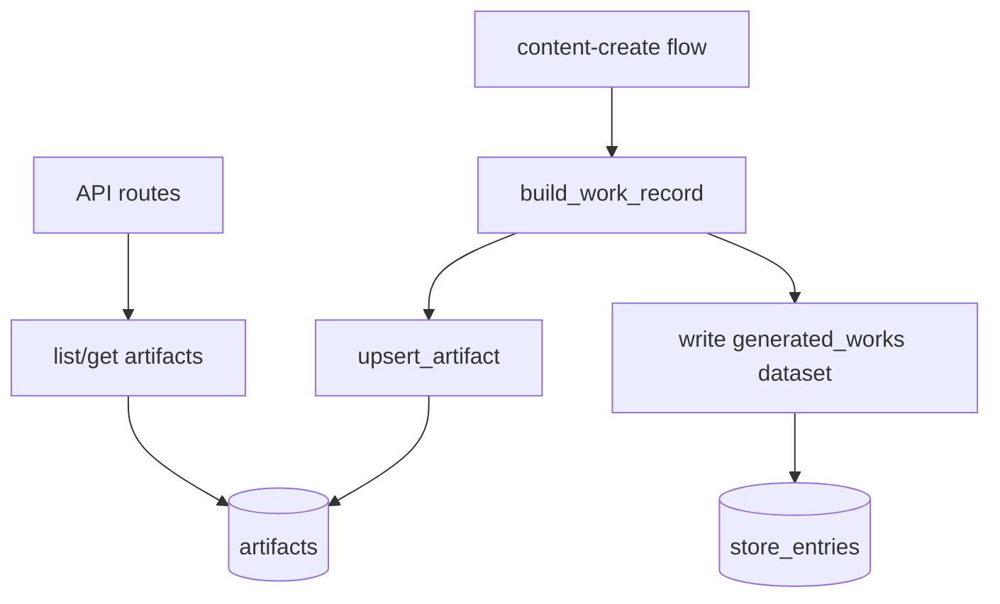

# 变更提案: artifact-content-storage

## 元信息
```yaml
类型: 新功能
方案类型: implementation
优先级: P1
状态: 已确认
创建: 2026-04-24
```

---

## 1. 需求

### 背景
当前项目已经有两类“产物”存储：

- 运行态 `artifacts`：保存在运行目录中的文件产物，适合调试和步骤级追踪，不适合作为业务查询数据源。
- 业务侧“生成作品库”：通过通用 `store_entries` 表写入结构化展示内容，但它更偏向数据集抽象，不是独立的一等业务实体。

现在需要增加一张明确的 `artifact` 业务表，用来持久化“创作完成后的内容”，让创作结果可以按租户、流程、批次稳定查询，并与运行记录建立关联，而不依赖运行目录文件或通用数据集表。

### 目标
- 新增独立的 PostgreSQL `artifacts` 业务表，保存创作完成后的标题、正文、标签、提示词、图片链接等内容。
- 将创作流程完成时的最终作品写入该表，并与 `tenant_id`、`flow_id`、`batch_id`、`workflow_run` 建立可追溯关联。
- 提供模型层与 HTTP 层的读取能力，便于后续在前端或第三方系统中按业务实体消费创作结果。

### 约束条件
```yaml
时间约束: 当前回合内完成实现与验证
性能约束: 保持当前 PostgreSQL 自动建表模式，不引入额外迁移框架
兼容性约束: 不破坏现有 workflow_runs、store_entries 和生成作品库写入流程
业务约束: artifact 表聚焦“创作完成内容”，不承担步骤级运行日志或通用数据集能力
```

### 验收标准
- [ ] 服务启动初始化数据库时会自动创建 `artifacts` 表和必要索引。
- [ ] 内容创作流程在生成完成后会向 `artifacts` 表写入一条业务记录，包含租户、流程、批次和最终作品核心内容。
- [ ] 提供按租户查询 artifact 列表和按主键读取详情的模型/API 能力。
- [ ] 现有测试通过，新增测试覆盖建表 SQL、模型 CRUD 和 HTTP 接口行为。

---

## 2. 方案

### 技术方案
采用“独立业务表 + 最小侵入接入”的实现方式：

1. 在 `model/db.py` 中新增 `artifacts` 表定义和索引，继续沿用项目现有的 `ensure_postgres_tables()` 自动建表机制。
2. 在 `model/types.py` 中新增 `Artifact` 数据结构，并新增 `model/artifact.py` 封装 CRUD。
3. 在内容创作流程中复用当前已构建的最终作品 payload，将其同步写入 `artifacts` 表；保留现有“生成作品库”写入，避免破坏已有数据面。
4. 在 `app/routes.py` / `app/schemas.py` 暴露只读接口，供前端或调用方查询 artifact 列表与详情。
5. 补充单元测试，覆盖 SQL 初始化、模型层和 API 层的行为。

### 影响范围
```yaml
涉及模块:
  - model: 新增 artifact 表类型与 CRUD
  - workflow/flow/content_create: 在创作完成时写入 artifact 业务记录
  - app: 暴露 artifact 查询接口
  - tests: 覆盖新表和新接口行为
预计变更文件: 8-12
```

### 风险评估
| 风险 | 等级 | 应对 |
|------|------|------|
| artifact 与 generated_works 职责重叠 | 中 | 明确 artifact 为独立业务实体，保留 generated_works 作为通用展示数据集 |
| 自动建表影响现有初始化逻辑 | 低 | 复用现有 SQL 初始化模式，新增测试断言 SQL 已包含 artifacts |
| 创作流程写入链路缺少运行上下文 | 中 | 仅依赖现有 context 中已存在的 tenant/flow/batch 信息，缺失时使用保守默认值并测试覆盖 |

---

## 3. 技术设计（可选）

> 涉及架构变更、API设计、数据模型变更时填写

### 架构设计


### API设计
#### GET /api/artifacts
- **请求**: 查询参数 `flow_id?`、`limit?`、`offset?`
- **响应**: `{ items: ArtifactResponse[], total: number, limit: number, offset: number }`

#### GET /api/artifacts/{artifact_id}
- **请求**: 路径参数 `artifact_id`
- **响应**: `ArtifactResponse`

### 数据模型
| 字段 | 类型 | 说明 |
|------|------|------|
| id | uuid | 主键 |
| tenant_id | text | 租户标识 |
| flow_id | text | 来源流程 |
| batch_id | text | 来源批次 |
| workflow_run_id | text | 关联运行记录 ID，可为空 |
| artifact_type | text | 业务类型，当前为 `content` |
| title | text | 作品标题 |
| content | text | 作品正文 |
| tags | text | 标签文本 |
| cover_prompt | text | 封面提示词 |
| cover_url | text | 封面图片地址 |
| image_prompts | jsonb | 配图提示词数组 |
| image_urls | jsonb | 配图地址数组 |
| payload | jsonb | 完整业务载荷，保留扩展字段 |
| source_url | text | 来源 URL，可选 |
| created_at | timestamptz | 创建时间 |
| updated_at | timestamptz | 更新时间 |

---

## 4. 核心场景

> 执行完成后同步到对应模块文档

### 场景: 创作完成后沉淀业务产物
**模块**: workflow/flow/content_create
**条件**: 某次内容创作流程已生成标题、正文、提示词和图片链接
**行为**: 流程在保留原有生成作品库写入的同时，将最终作品写入 `artifacts` 业务表
**结果**: 调用方可以通过 artifact 列表/详情接口读取到该作品，并通过批次号追溯到运行记录

### 场景: 按租户查询创作结果
**模块**: app + model
**条件**: 租户通过 API Key 完成鉴权
**行为**: 调用方访问 artifact 列表接口，按租户和可选流程过滤读取结果
**结果**: 返回最近的业务作品列表和分页总数

---

## 5. 技术决策

> 本方案涉及的技术决策，归档后成为决策的唯一完整记录

### artifact-content-storage#D001: 采用独立 artifact 业务表而不是扩展通用 store_entries
**日期**: 2026-04-24
**状态**: ✅采纳
**背景**: 当前项目已有 `store_entries` 和运行目录 `artifacts`，但都不适合直接承担“创作完成内容”的一等业务实体职责。
**选项分析**:
| 选项 | 优点 | 缺点 |
|------|------|------|
| A: 新增独立 artifacts 表 | 语义清晰、查询简单、便于后续扩展审核/发布状态 | 需要新增模型和接口 |
| B: 扩展 store_entries/generated_works | 改动看起来更少 | 业务语义继续混在通用数据集里，后续查询和约束不清晰 |
**决策**: 选择方案 A
**理由**: 用户明确希望增加一张 artifact 相关的表来存储创作完成内容，独立表最符合目标且不会把运行产物、数据集抽象和业务作品继续混在一起。
**影响**: 影响 `model`、`workflow/flow/content_create`、`app` 和相应测试

---

## 6. 成果设计

> 含视觉产出的任务由 DESIGN Phase2 填充。非视觉任务整节标注"N/A"。

N/A（本次为后端数据模型与接口改动，无视觉交付物）
