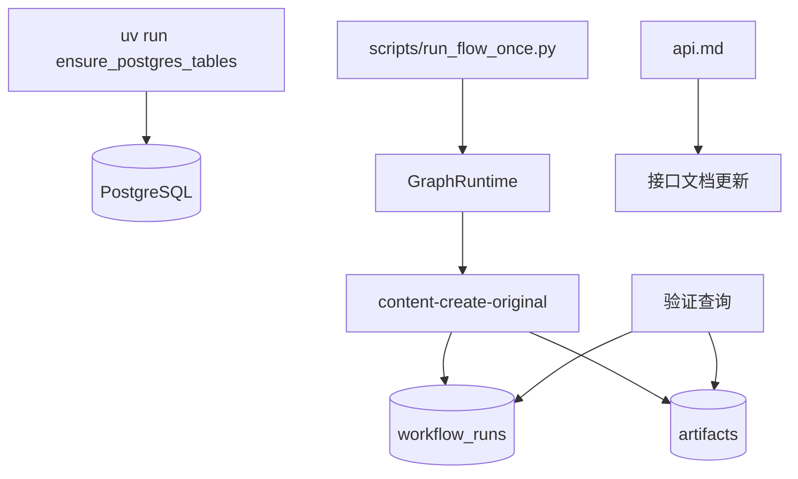

# 变更提案: artifact-db-sync-and-flow-test

## 元信息
```yaml
类型: 验证/文档同步
方案类型: implementation
优先级: P1
状态: 已确认
创建: 2026-04-24
```

---

## 1. 需求

### 背景
上一轮已经完成 `artifacts` 独立业务表、模型 CRUD、创作流程写入和只读接口实现，但还没有在真实数据库上同步表结构并跑一遍原创创作流程验证是否能正常落表。同时，接口文档 `api.md` 还未补充新的 artifact 查询接口与使用方式。

### 目标
- 使用当前项目 `.env` 中的 PostgreSQL 连接执行数据库表同步，确保远端数据库存在最新 `artifacts` 表结构。
- 在具备前置数据的真实租户上运行一次 `content-create-original`，确认流程能完成并将结果写入 `artifacts` 表。
- 查询并核对实际落表结果，确认关键字段正确。
- 将新增 artifact 接口和使用方式更新到 `api.md`。

### 约束条件
```yaml
时间约束: 当前回合内完成同步、验证和文档更新
性能约束: 优先复用现有脚本和 uv 环境，不额外引入迁移框架
兼容性约束: 不改动现有业务逻辑，仅在必要时修复阻断流程执行的问题
业务约束: 只测试原创流程 content-create-original；优先使用已有租户和现成输入数据
```

### 验收标准
- [ ] 远端 PostgreSQL 已执行 `ensure_postgres_tables()`，`artifacts` 表结构同步完成。
- [ ] 至少成功运行一次 `content-create-original`，且 run 不是 `failed/blocked`。
- [ ] `artifacts` 表中出现对应批次的新记录，并可核对 `tenant_id`、`flow_id`、`batch_id`、标题、正文、图片链接等关键字段。
- [ ] `api.md` 已补充 artifact 列表/详情接口说明与示例。

---

## 2. 方案

### 技术方案
采用“先同步、再真实跑、最后查表和补文档”的闭环验证方式：

1. 使用 `uv run` 加载项目依赖环境，调用 `ensure_postgres_tables()` 同步远端数据库结构。
2. 先扫描租户和数据集，定位具备“营销策划方案 + 日报”输入的租户；当前预期使用 `tenant-2`。
3. 通过现有 `scripts/run_flow_once.py` 或等效 `GraphRuntime.run()` 入口执行一次 `content-create-original`。
4. 执行完成后同时查询 `workflow_runs` 和 `artifacts`，确认运行成功且产物已正常落库。
5. 根据实际验证结果更新 `api.md`。

### 影响范围
```yaml
涉及模块:
  - runtime/model: 真实验证数据库同步与创作流程写库行为
  - api.md: 补充 artifact 接口文档和示例
  - .helloagents: 记录方案和验证结果
预计变更文件: 3-5
```

### 风险评估
| 风险 | 等级 | 应对 |
|------|------|------|
| 真实流程依赖外部 LLM/生图/S3 接口，可能因网络或额度失败 | 中 | 优先直接复用 `.env` 与现有租户配置，失败时保留错误并据实记录 |
| 租户前置数据不足导致流程阻断 | 中 | 先扫描租户输入数据，只在具备“营销策划方案 + 日报”的租户上运行 |
| API 文档与实际返回结构不一致 | 低 | 以当前代码和真实查询结果为准更新 `api.md` |

---

## 3. 技术设计（可选）

### 架构设计


### API设计
#### GET /api/artifacts
- **请求**: `flow_id?`、`limit?`、`offset?`
- **响应**: 返回当前租户 artifact 列表和分页信息

#### GET /api/artifacts/{artifact_id}
- **请求**: 路径参数 `artifact_id`
- **响应**: 返回单条 artifact 详情

### 数据模型
| 字段 | 类型 | 说明 |
|------|------|------|
| tenant_id | text | 验证实际落表租户 |
| flow_id | text | 应为 `content-create-original` |
| batch_id | text | 与本次运行批次对应 |
| title | text | 创作产物标题 |
| content | text | 创作产物正文 |
| cover_url | text | 生成并转存后的封面链接 |
| image_urls | jsonb | 生成并转存后的配图链接列表 |

---

## 4. 核心场景

### 场景: 同步表后执行原创创作并验证 artifact 落库
**模块**: runtime / flows / model
**条件**: 目标租户已具备“营销策划方案”和至少一条“日报”输入
**行为**: 使用真实 `.env` 运行一次 `content-create-original`，并在结束后查询 `workflow_runs` 与 `artifacts`
**结果**: 新批次运行成功，`artifacts` 表中出现对应记录

---

## 5. 技术决策

### artifact-db-sync-and-flow-test#D001: 复用现有 uv 环境和 run_flow_once 脚本做真实流程验证
**日期**: 2026-04-24
**状态**: ✅采纳
**背景**: 本地系统 Python 缺少项目依赖，但 `uv run` 可以正确加载 `fastapi/langchain/psycopg` 等运行环境，仓库中也已有 `scripts/run_flow_once.py` 可直接触发单次流程。
**选项分析**:
| 选项 | 优点 | 缺点 |
|------|------|------|
| A: 复用 `uv run` + `scripts/run_flow_once.py` | 最贴近真实运行环境，改动最小 | 依赖真实外部服务，失败噪声更高 |
| B: 临时手写验证脚本或 mock 流程 | 可控性更强 | 不能证明真实落表链路打通 |
**决策**: 选择方案 A
**理由**: 用户明确要求“同步数据库表、测试创作流程、检查是否能正常落表”，应优先验证真实链路而不是模拟链路。
**影响**: 影响本次验证路径和 `api.md` 更新内容

---

## 6. 成果设计

N/A（本次为数据库同步、流程验证和接口文档更新，无视觉交付物）
