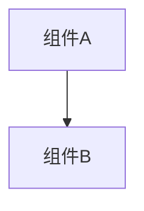

# 变更提案: flow-list-name-description

## 元信息
```yaml
类型: 新功能
方案类型: implementation
优先级: P2
状态: 已完成
创建: 2026-04-24
```

---

## 1. 需求

### 背景
当前 `GET /api/flows` 已经返回 `id` 和 `run_request_schema`，但前端仍缺少可直接展示给用户的工作流名称与用途说明。
如果继续只靠 `id`，前端需要自行维护一份映射表，和后端注册表容易产生漂移。

### 目标
让工作流列表接口为每个 flow 返回中文 `name` 和 `description`，便于前端直接展示。

### 约束条件
```yaml
时间约束: 无
性能约束: 不引入额外动态扫描
兼容性约束:
  - 保留现有 `id` 与 `run_request_schema`
  - 新增 `name`、`description` 为向后兼容扩展
业务约束:
  - `name` 和 `description` 使用中文
  - 展示文案统一在 flow 注册表集中维护
```

### 验收标准
- [ ] `GET /api/flows` 的每个条目都包含中文 `name`
- [ ] `GET /api/flows` 的每个条目都包含中文 `description`
- [ ] 测试与 `api.md` 同步更新

---

## 2. 方案

### 技术方案
在 `workflow/flow/registry.py` 的 `FLOW_DEFINITIONS` 中，为每个 flow 增加 `name` 和 `description` 元数据，
并让 `list_flow_definitions()` 在返回时一并透传这两个字段。同步更新路由测试、注册表测试和 `api.md` 的返回示例。

### 影响范围
```yaml
涉及模块:
  - workflow.flow.registry: 新增 flow 展示元数据
  - tests: 覆盖 `name` 与 `description` 返回值
  - docs: 更新 `api.md` 示例
预计变更文件: 4
```

### 风险评估
| 风险 | 等级 | 应对 |
|------|------|------|
| 文案与实际业务用途不匹配 | 低 | 统一在注册表维护，和 flow 定义一起演进 |
| 前端依赖旧结构 | 低 | 仅新增字段，不删除旧字段 |

---

## 3. 技术设计（可选）

> 涉及架构变更、API设计、数据模型变更时填写

### 架构设计


### API设计
#### GET /api/flows
- **请求**: 无请求体，仍要求 `X-API-Key`
- **响应**: 每个 flow 返回 `id`、中文 `name`、中文 `description` 和 `run_request_schema`

### 数据模型
| 字段 | 类型 | 说明 |
|------|------|------|
| {字段} | {类型} | {说明} |

---

## 4. 核心场景

> 执行完成后同步到对应模块文档

### 场景: 前端展示工作流列表
**模块**: API / Flow Registry
**条件**: 前端调用 `GET /api/flows`
**行为**: 后端返回 flow 的 `id`、`name`、`description`、`run_request_schema`
**结果**: 前端无需额外维护映射表，直接展示工作流卡片和说明文案

---

## 5. 技术决策

> 本方案涉及的技术决策，归档后成为决策的唯一完整记录

### flow-list-name-description#D001: 将展示文案与执行 schema 一并放入 flow 注册表
**日期**: 2026-04-24
**状态**: ✅采纳
**背景**: 前端既需要执行参数定义，也需要展示名称和用途说明。
**选项分析**:
| 选项 | 优点 | 缺点 |
|------|------|------|
| A: 在前端单独维护名称和描述 | 前端改动快 | 容易与后端注册表漂移 |
| B: 在后端 flow 注册表统一维护 | 数据源单一，接口可直接消费 | 需要同步更新测试和文档 |
**决策**: 选择方案 B
**理由**: 展示元数据和执行 schema 都属于 flow 定义的一部分，统一维护更稳定
**影响**: 影响 `workflow.flow.registry`、测试和 `api.md`

---

## 6. 成果设计

> 含视觉产出的任务由 DESIGN Phase2 填充。非视觉任务整节标注"N/A"。

N/A。本任务无视觉产出。
