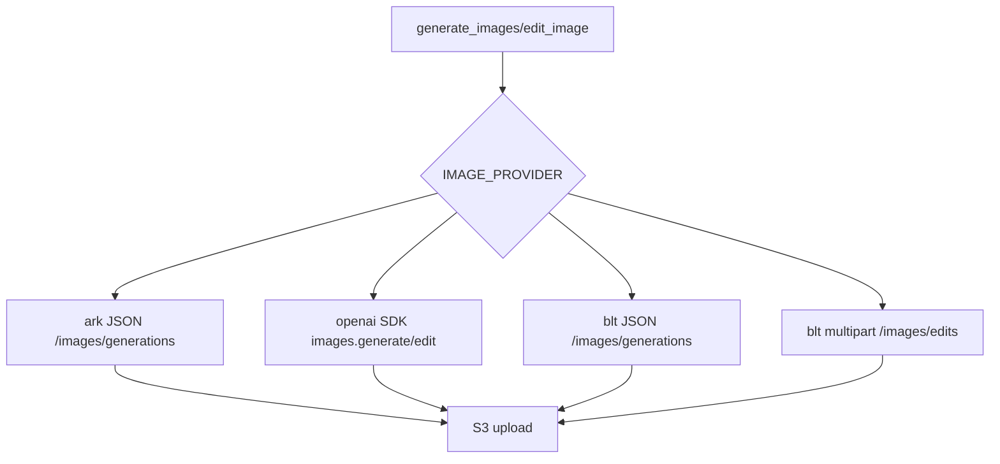

# 变更提案: blt-image-provider

## 元信息
```yaml
类型: 新功能
方案类型: implementation
优先级: P1
状态: 已确认
创建: 2026-04-28
```

---

## 1. 需求

### 背景
当前图片集成层支持 `ark` 和 `openai` 两类 provider。用户提供了 BLT 图片生成与图片编辑接口调用方式，要求在现有项目中新增 `blt` provider，并明确使用当前项目已经统一的 `IMAGE_API_*` 配置入口。

### 目标
- `IMAGE_PROVIDER=blt` 时，图片生成走 JSON `POST /images/generations`。
- `IMAGE_PROVIDER=blt` 时，图片编辑走 multipart `POST /images/edits`，字段结构遵循用户提供的 BLT 调用方式。
- BLT provider 复用 `IMAGE_API_BASE_URL`、`IMAGE_API_KEY`、`IMAGE_API_MODEL`，不新增平行配置体系。
- 保持现有 S3 上传、artifact 回写和 `ark/openai` provider 行为不回退。

### 约束条件
```yaml
时间约束: 尽快完成接口修正
性能约束: 不改变现有超时与重试策略
兼容性约束: 保持 ark/openai 配置和调用方式兼容
业务约束: blt 必须使用用户提供的 API 调用协议，不走 OpenAI SDK
```

### 验收标准
- [ ] `resolve_image_provider`、API schema 和文档均接受 `blt`。
- [ ] `blt` 生图请求 payload 包含 `model`、`prompt`、可选 `response_format`，并调用 `/images/generations`。
- [ ] `blt` 改图请求使用 multipart form-data，包含 `model`、`prompt`、可选 `response_format` 和 `image` 文件，并调用 `/images/edits`。
- [ ] BLT 返回 `url` 或 `b64_json` 时可复用现有 S3 上传逻辑。
- [ ] 新增/更新单元测试覆盖 BLT 生成、编辑和不支持 provider 分支。

---

## 2. 方案

### 技术方案
- 在 `workflow/integrations/image_generation.py` 中扩展 provider 集合为 `ark/openai/blt`。
- 新增 BLT 专用请求函数：生成使用标准库 JSON POST；编辑使用标准库 multipart/form-data POST，避免依赖 OpenAI SDK。
- 复用现有 `build_image_payload` 构造 `model/prompt/response_format`，BLT 仅在 step 存在 `aspect_ratio` 时追加该字段。
- 扩展响应解析，让 `blt` 与 `openai` 一样支持 URL 和 base64 图片结果。
- 更新 `app/schemas.py`、`.env.example`、`README.md`、`api.md` 中 provider 说明与示例。
- 增补 `tests/test_content_create_images.py` 覆盖 BLT 生成与编辑分支。

### 影响范围
```yaml
涉及模块:
  - integrations: 新增 blt provider 请求分发、响应解析和 multipart 编辑请求
  - app: 租户自定义 api_ref 校验说明兼容 blt provider
  - tests: 增加图片集成层 provider 测试
  - docs: 更新环境变量和 API 示例说明
预计变更文件: 6
```

### 风险评估
| 风险 | 等级 | 应对 |
|------|------|------|
| BLT 响应字段与预期不一致 | 中 | 响应解析同时支持 `data[].url`、`data[].b64_json` 和顶层 `image_url` |
| multipart 文件字段格式不符合远端要求 | 中 | 按用户提供参考实现使用 `image` 文件字段，并用测试断言请求结构 |
| 影响现有 openai/ark 行为 | 低 | 保持原分支逻辑，仅新增 `blt` 分支并运行相关测试 |

---

## 3. 技术设计（可选）

> 涉及架构变更、API设计、数据模型变更时填写

### 架构设计


### API设计
#### BLT POST /images/generations
- **请求**: JSON，包含 `model`、`prompt`、可选 `aspect_ratio`、`response_format`
- **响应**: 兼容 `data[].url`、`data[].b64_json` 或顶层 `image_url`

#### BLT POST /images/edits
- **请求**: multipart/form-data，字段包含 `model`、`prompt`、可选 `aspect_ratio`、`response_format`，文件字段为 `image`
- **响应**: 兼容 `data[].url`、`data[].b64_json` 或顶层 `image_url`

### 数据模型
| 字段 | 类型 | 说明 |
|------|------|------|
| IMAGE_PROVIDER | string | 新增支持 `blt` |
| IMAGE_API_BASE_URL | string | BLT API base URL |
| IMAGE_API_KEY | string | BLT API key |
| IMAGE_API_MODEL | string | BLT 生图/改图模型 |

---

## 4. 核心场景

> 执行完成后同步到对应模块文档

### 场景: BLT 文生图
**模块**: integrations
**条件**: 租户或系统配置 `IMAGE_PROVIDER=blt`
**行为**: `generate_images` 按 BLT JSON 协议请求 `/images/generations`
**结果**: 返回图片结果被解析并上传到 S3

### 场景: BLT 改图
**模块**: integrations
**条件**: 租户或系统配置 `IMAGE_PROVIDER=blt` 且存在参考图
**行为**: `edit_image` 下载参考图后按 BLT multipart 协议请求 `/images/edits`
**结果**: 返回图片结果被解析并上传到 S3，artifact 图片地址更新

---

## 5. 技术决策

> 本方案涉及的技术决策，归档后成为决策的唯一完整记录

### blt-image-provider#D001: BLT provider 复用 IMAGE_API_* 配置
**日期**: 2026-04-28
**状态**: ✅采纳
**背景**: 项目已经将图片 provider 配置统一为 `IMAGE_PROVIDER` 与 `IMAGE_API_*`，用户确认 BLT 也沿用这一套配置。
**选项分析**:
| 选项 | 优点 | 缺点 |
|------|------|------|
| A: 沿用 `IMAGE_API_*` | 与现有租户配置、文档和校验一致，变更最小 | BLT 参考代码中的变量名需要映射 |
| B: 新增 `IMAGE_BASE_URL/IMAGE_MODEL` | 完全贴合参考脚本 | 项目内形成两套配置入口，增加迁移和校验复杂度 |
**决策**: 选择方案 A
**理由**: 用户已确认选项 1；当前项目的租户 `api_ref` 和系统配置都围绕 `IMAGE_API_*`，复用该结构可以避免额外兼容层。
**影响**: 影响图片集成层、租户配置说明、文档示例和测试。

---

## 6. 成果设计

N/A：本任务为后端 provider 集成，不产生视觉交付物。

### 技术约束
- **可访问性**: N/A
- **响应式**: N/A
