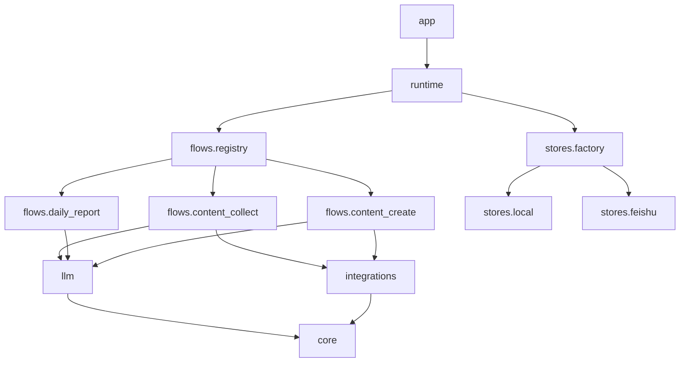

# 变更提案: langgraph-flow-centric-refactor

## 元信息
```yaml
类型: 重构
方案类型: implementation
优先级: P0
状态: 已确认
创建: 2026-04-21
```

---

## 1. 需求

### 背景
当前仓库已经具备 `app / runtime / graphs / nodes / services / stores` 的基本分层，但职责切面仍然混杂：

- `graphs/` 与 `nodes/` 按技术层分散，阅读单条流程时需要跨目录来回切换。
- `services/` 同时承载通用 LLM 能力、prompt 加载、第三方接口、领域逻辑和流程专用生成逻辑，语义边界不清。
- `stores/factory.py` 与 `services/content_create.py` 属于过载文件，维护成本高。
- 缺少针对图编译与运行时装配的基础测试，无法稳定验证重构后的装配链路。

### 目标

- 将项目重构为以 flow 为中心的 LangGraph 结构，提升可读性和扩展性。
- 让节点函数更聚焦于“读取状态、调用能力、返回状态补丁”。
- 将通用能力下沉到稳定的基础层，把流程专用生成逻辑收敛到对应 flow 目录。
- 拆分超大文件，降低单文件复杂度。
- 保持现有 HTTP API 与流程 ID 不变，确保运行结果保持兼容。
- 补充至少一组运行时/图装配 smoke test。

### 约束条件
```yaml
时间约束: 单次重构内完成目录迁移、导入修正、基础验证
性能约束: 不引入额外网络往返和明显运行时开销
兼容性约束: 现有 /flows 与 run 查询接口保持不变
业务约束: content-collect、daily-report、content-create-original、content-create-rewrite 四条流程继续可用
```

### 验收标准
- [ ] Flow 定义改为按业务流程聚合，图、节点、生成逻辑可以在同一 flow 目录内追踪。
- [ ] 通用 LLM、prompt、env、文本工具与第三方集成从原 `services/` 中拆分到稳定基础层。
- [ ] `stores/factory.py` 不再承担全部存储实现，至少拆为协议/本地/飞书/工厂装配几个明确模块。
- [ ] `runtime` 与 `app` 的对外行为保持兼容，现有 flow ID 与路由不变。
- [ ] 增加可运行的 smoke test，用于验证图装配或运行时主链路。

---

## 2. 方案

### 技术方案
采用 Flow-Centric 重构方案：

1. 引入 `flows/` 作为新的核心目录，按业务流组织 `graph.py`、`nodes.py`、`generation.py` 与 flow 内部工具。
2. 引入基础层包：
   - `core/`：环境变量与通用文本工具。
   - `llm/`：LangChain/LangGraph 共享的模型调用、消息构建、prompt 渲染。
   - `integrations/`：热点等外部接口集成。
3. 重构 `stores/`：
   - `base.py` 负责协议、异常与共享工具。
   - `local.py` 负责本地数据后端。
   - `feishu.py` 负责飞书后端。
   - `factory.py` 负责选择和装配。
4. 保留 `runtime/` 与 `app/` 顶层入口，但将流程注册切换到 `flows.registry`。
5. 删除旧的 `graphs/`、`nodes/`、`services/` 平铺结构，避免继续保留过渡层。

### 影响范围
```yaml
涉及模块:
  - app: 保持接口不变，仅更新依赖导入
  - runtime: 切换到新的 flow registry
  - flows: 新建 flow-centric 目录，承接原 graphs/nodes/flow-specific services
  - llm/core/integrations: 承接原 services 的通用与外部能力
  - stores: 拆分 factory.py
  - pyproject.toml/README.md: 更新包发现与项目结构说明
  - tests: 新增 smoke tests
预计变更文件: 30+
```

### 风险评估
| 风险 | 等级 | 应对 |
|------|------|------|
| 大量导入路径调整导致运行时装配断裂 | 高 | 逐层迁移并补 smoke test 验证 `GraphRuntime.run()` 主链路 |
| 目录迁移后遗漏资源路径，导致 prompt 无法读取 | 中 | 保持 prompt 根目录清晰，并为各 flow 使用显式相对路径 |
| 删除旧层级后出现隐性依赖遗漏 | 中 | 使用 `rg` 全量搜索旧导入并在测试前做静态扫描 |
| 存储层拆分后行为回归 | 中 | 保持 `build_store()` 契约不变，优先做结构拆分不改行为 |

---

## 3. 技术设计

### 架构设计


### API设计
#### POST /flows/{flow_id}/runs
- **请求**: 保持现有 `RunFlowRequest`
- **响应**: 保持现有运行结果结构

#### GET /flows/{flow_id}/runs/{tenant_id}/{batch_id}
- **请求**: 保持现有路径参数
- **响应**: 保持 `state.json` 读取行为

### 数据模型
| 字段 | 类型 | 说明 |
|------|------|------|
| WorkflowState | TypedDict | LangGraph 运行状态，保持现有 reducer 逻辑 |
| RunRequest | dataclass | 运行时请求入参，保持现有字段 |
| Store | Protocol | 数据后端统一契约 |

---

## 4. 核心场景

### 场景: 流程定义就地阅读
**模块**: flows/*
**条件**: 需要理解某条业务流的运行方式
**行为**: 在同一 flow 目录下查看图定义、节点实现和生成逻辑
**结果**: 不需要在 `graphs/`、`nodes/`、`services/` 多目录之间来回跳转

### 场景: 运行时装配
**模块**: runtime / flows.registry / stores
**条件**: API 调用 `POST /flows/{flow_id}/runs`
**行为**: runtime 通过 flow registry 获取图定义，结合 store factory 构建上下文并执行图
**结果**: 返回与现有行为兼容的最终 state

### 场景: 共享能力复用
**模块**: llm / core / integrations
**条件**: flow 节点需要调用模型、读取 prompt 或访问外部服务
**行为**: 使用稳定基础层 API 完成能力调用
**结果**: 节点不再直接夹带底层实现细节

---

## 5. 技术决策

### langgraph-flow-centric-refactor#D001: 采用 Flow-Centric 目录而非传统分层后端目录
**日期**: 2026-04-21
**状态**: ✅采纳
**背景**: 当前项目是多条固定 LangGraph 工作流，主要维护成本来自“读流程需要跨多个技术层目录切换”。
**选项分析**:
| 选项 | 优点 | 缺点 |
|------|------|------|
| A: Flow-Centric（按 flow 聚合 graph/node/generation） | 最贴合 LangGraph 心智模型，新增流程简单，阅读路径短 | 首轮迁移目录改动较大 |
| B: 传统 application/domain/infrastructure 分层 | 依赖边界清晰，适合大型后端 | 对当前项目偏重，弱化 graph 作为核心组织单元 |
**决策**: 选择方案 A
**理由**: 该项目的核心资产是多个 LangGraph 流程，优先优化“按流程阅读与维护”的体验，比引入更重的传统分层更合适。
**影响**: 影响 `graphs`、`nodes`、`services`、`runtime`、`stores`、README 与打包配置。

### langgraph-flow-centric-refactor#D002: 删除旧平铺层，不保留兼容包装
**日期**: 2026-04-21
**状态**: ✅采纳
**背景**: 如果继续保留 `graphs/`、`nodes/`、`services/` 兼容包装，会让新旧结构长期并存，违背本次精简目标。
**选项分析**:
| 选项 | 优点 | 缺点 |
|------|------|------|
| A: 保留兼容包装 | 迁移平滑 | 结构冗余，后续维护双份入口 |
| B: 一次性切到新结构 | 结构干净，长期成本低 | 本轮需要同步完成全部导入修正 |
**决策**: 选择方案 B
**理由**: 用户目标是“继续优化并精简项目”，因此优先保证最终结构整洁，而不是保守保留中间兼容层。
**影响**: 本轮完成后旧目录将被删除，运行入口全部切换到新包。

---

## 6. 成果设计

本次为非视觉重构任务，N/A。
