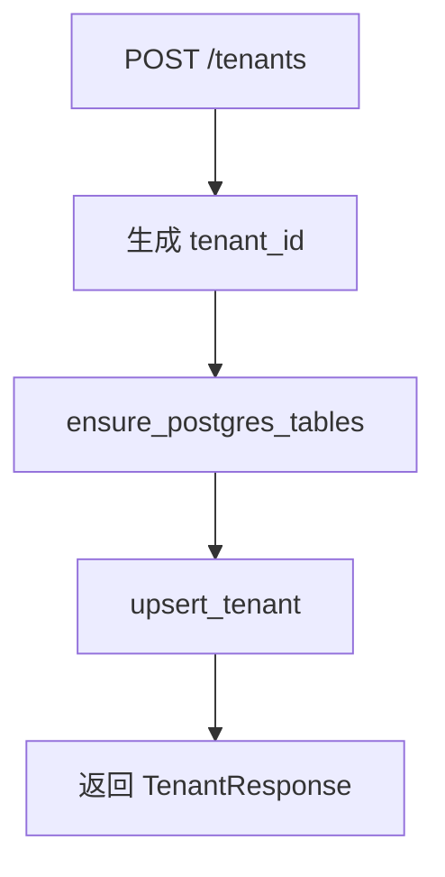

# 变更提案: tenant-name-only-create

## 元信息
```yaml
类型: 新功能
方案类型: implementation
优先级: P1
状态: 已确认
创建: 2026-04-22
```

---

## 1. 需求

### 背景
当前租户创建接口使用 `PUT /tenants/{tenant_id}`，调用方必须显式提供路径参数里的 `tenant_id`。
用户希望“新增租户”时只输入租户名称即可完成创建，而不是先决定内部标识。

### 目标
- 提供一个只要求 `tenant_name` 的创建入口。
- 服务端自动生成稳定且唯一的 `tenant_id`。
- 保持现有 PostgreSQL 表结构不变，并能继续兼容现有按 `tenant_id` 查询和运行流程。
- 启动项目后实际创建一个租户，验证接口和数据库写入生效。

### 约束条件
```yaml
时间约束: 当前回合内完成实现、验证和一次真实创建
性能约束: 自动生成 tenant_id 不引入额外数据库迁移或复杂查询
兼容性约束: 保留现有 PUT /tenants/{tenant_id} 接口，不破坏现有调用方
业务约束: tenants 表仍以 tenant_id 作为业务唯一键，不能改成仅存 tenant_name
```

### 验收标准
- [ ] 新增仅传租户名称的创建接口，请求中不再要求调用方手填 tenant_id
- [ ] 服务端会基于 tenant_name 生成 tenant_id，并处理重名冲突
- [ ] 路由测试覆盖成功创建场景和 tenant_id 自动生成行为
- [ ] 服务成功启动，并使用真实 PostgreSQL 创建至少一个租户

---

## 2. 方案

### 技术方案
- 在 `app.schemas` 新增仅创建租户的请求模型。
- 在 `app.routes` 新增 `POST /tenants` 接口，仅接收 `tenant_name` 和可选租户配置字段。
- 在 `app.model` 新增 `generate_tenant_id()` 及辅助逻辑：
  - 先把 `tenant_name` 规整为 slug；
  - slug 为空时回退到 `tenant`;
  - 查询现有 `tenant_id`，若冲突则追加 `-2`、`-3` 等后缀直到唯一。
- 保留现有 `PUT /tenants/{tenant_id}` 作为兼容入口。
- 补充测试后启动服务，调用新接口完成真实创建。

### 影响范围
```yaml
涉及模块:
  - app/routes.py: 新增租户创建入口并复用现有建表/写库流程
  - app/model.py: 增加 tenant_id 自动生成能力
  - app/schemas.py: 增加 POST /tenants 请求模型
  - tests/test_app_routes.py: 增加路由测试并校验自动生成逻辑
  - README.md: 更新租户创建接口说明
预计变更文件: 5
```

### 风险评估
| 风险 | 等级 | 应对 |
|------|------|------|
| tenant_name 生成的 slug 重复 | 中 | 通过数据库现有 tenant_id 检测并自动追加序号 |
| 现有客户端依赖 PUT 接口 | 低 | 保留 PUT 路由不变，仅新增 POST 路由 |
| 真实环境服务启动或数据库连接失败 | 中 | 使用现有 `.env`，先本地启动再调用新接口验证 |

---

## 3. 技术设计（可选）

> 涉及架构变更、API设计、数据模型变更时填写

### 架构设计


### API设计
#### POST /tenants
- **请求**: `tenant_name` 必填，`is_active/default_llm_model/timeout_seconds/max_retries` 可选
- **响应**: 包含自动生成的 `tenant_id` 和租户配置字段

#### PUT /tenants/{tenant_id}
- **请求**: 保持现状
- **响应**: 保持现状

### 数据模型
| 字段 | 类型 | 说明 |
|------|------|------|
| tenant_name | text | 用户输入的展示名称 |
| tenant_id | text | 服务端自动生成的唯一业务标识 |

---

## 4. 核心场景

> 执行完成后同步到对应模块文档

### 场景: 只输入租户名称创建租户
**模块**: `app/routes.py`
**条件**: 已配置 `DATABASE_URL`，服务正常启动
**行为**: 客户端调用 `POST /tenants` 并传入 `tenant_name`
**结果**: 服务自动生成唯一 `tenant_id`，写入 `tenants` 表并返回完整租户信息

---

## 5. 技术决策

> 本方案涉及的技术决策，归档后成为决策的唯一完整记录

### tenant-name-only-create#D001: 以新增 POST 接口实现“仅名称创建租户”
**日期**: 2026-04-22
**状态**: ✅采纳
**背景**: 用户不希望在新增租户时手动指定内部 `tenant_id`，但系统内部和现有流程仍依赖 `tenant_id`。
**选项分析**:
| 选项 | 优点 | 缺点 |
|------|------|------|
| A: 修改现有 PUT 接口为自动生成 | 用户入口少 | 与 REST 语义不一致，且路径参数仍然存在，无法真正做到“无需指定” |
| B: 新增 POST /tenants 创建接口 | 语义清晰，兼容旧接口，改动局部可控 | 需要维护两条入口 |
**决策**: 选择方案 B
**理由**: 它能满足“只传名称”的产品目标，同时最小化对现有接口和运行流程的破坏。
**影响**: `app/routes.py`、`app/model.py`、`app/schemas.py`、测试和 README

---

## 6. 成果设计

> 含视觉产出的任务由 DESIGN Phase2 填充。非视觉任务整节标注"N/A"。

N/A（非视觉任务）
