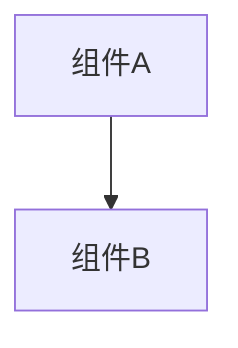

# 变更提案: node-internal-execution-logs

## 元信息
```yaml
类型: 新功能
方案类型: implementation
优先级: P1
状态: 进行中
创建: 2026-04-22
```

---

## 1. 需求

### 背景
当前运行时只会在 `events.jsonl` 里记录 run/node 的起止事件，以及在 `state.json` 中维护节点状态。节点内部读取数据、调用外部接口、写入文档/表格、写工件等关键步骤没有过程日志。实际运行异常或卡住时，只能看到“卡在某个节点”，无法进一步确认是缺输入、接口慢、写入失败，还是某个子步骤尚未完成。

### 目标
- 为每个节点增加统一的结构化内部执行日志
- 让排查信息至少覆盖：当前子步骤、关键输入摘要、外部调用前后、工件写入、阻断/软失败/异常原因、阶段耗时
- 不改变现有业务输出结构和 API 入口行为，仅增强运行期可观测性

### 约束条件
```yaml
时间约束: 无
性能约束: 日志写入为轻量级本地 JSONL 追加，不能显著拖慢节点执行
兼容性约束: 保持现有 state.json 和已有 run/node 级事件兼容
业务约束: 不修改现有流程节点的业务语义和外部依赖协议
```

### 验收标准
- [ ] `events.jsonl` 中可看到节点内部结构化日志，包含子步骤名和事件类型
- [ ] 失败、阻断、软失败路径都会留下可排查的上下文日志
- [ ] 现有 flow 节点统一接入日志 helper，而不是零散手写事件
- [ ] 运行时 smoke test 和新增日志测试通过

---

## 2. 方案

### 技术方案
- 在 `workflow/runtime` 中新增统一运行日志接口，封装 `node_step_started`、`node_step_finished`、`node_step_failed` 等结构化事件写入
- 扩展 `RuntimeContext` 暴露日志入口，避免各节点直接依赖持久化仓储
- 在 `workflow/flow/common.py` 增加节点级日志 helper，用于记录普通步骤、阻断、软失败、工件写入和输出摘要
- 将 `content_collect`、`content_create`、`daily_report` 的节点逐步接入统一 helper，在关键子步骤处补日志
- 增加针对 `events.jsonl` 的测试，确保 run/node 边界事件和节点内部事件一起可用

### 影响范围
```yaml
涉及模块:
  - workflow.runtime: 新增结构化内部日志写入能力
  - workflow.flow.common: 提供统一节点日志 helper
  - workflow.flow.content_collect: 接入数据读取、外部抓取、生成、写入等日志
  - workflow.flow.content_create: 接入抓取、生成、图片处理、写库等日志
  - workflow.flow.daily_report: 接入依赖检查、生成、写库等日志
  - tests: 校验日志事件落盘
  - .helloagents/modules: 同步运行时与 flow 文档
预计变更文件: 9
```

### 风险评估
| 风险 | 等级 | 应对 |
|------|------|------|
| 日志埋点分散，后续维护成本高 | 中 | 先抽公共 helper，再在节点里复用 |
| 事件过多导致日志噪音偏大 | 中 | 只记录关键步骤和摘要，不写整块原始数据 |
| 失败路径遗漏日志 | 中 | 统一通过 `block_state` / `soft_fail_state` / node wrapper 补齐 |

---

## 3. 技术设计（可选）

> 涉及架构变更、API设计、数据模型变更时填写

### 架构设计


### API设计
#### {METHOD} {路径}
- **请求**: {结构}
- **响应**: {结构}

### 数据模型
| 字段 | 类型 | 说明 |
|------|------|------|
| {字段} | {类型} | {说明} |

---

## 4. 核心场景

> 执行完成后同步到对应模块文档

### 场景: 节点内部执行排障
**模块**: workflow.runtime / workflow.flow.*
**条件**: 用户触发任意 flow run，节点进入内部执行阶段
**行为**: 运行时在节点开始后，按子步骤将结构化事件追加到 `events.jsonl`，包含步骤名、事件类型、摘要、耗时和异常信息
**结果**: 排查时不仅知道卡在哪个节点，还能知道卡在节点内部的哪一步

---

## 5. 技术决策

> 本方案涉及的技术决策，归档后成为决策的唯一完整记录

### node-internal-execution-logs#D001: 节点内部日志基于现有 events.jsonl 扩展而不是新增独立日志文件
**日期**: 2026-04-22
**状态**: ✅采纳
**背景**: 当前运行目录已经有 `events.jsonl`，但只有 run/node 边界事件。如果新增独立日志文件，会增加读取入口和维护成本，也会把一次 run 的排查信息拆散到多个文件。
**选项分析**:
| 选项 | 优点 | 缺点 |
|------|------|------|
| A: 新增 `node_logs.jsonl` 独立记录内部日志 | 边界清晰 | 需要多文件联查，集成成本更高 |
| B: 在现有 `events.jsonl` 中扩展内部事件 | run/node/step 事件同源，兼容现有目录结构，读取更直接 | 需要规范事件字段避免混乱 |
**决策**: 选择方案 B
**理由**: 在不改目录结构和查询入口的前提下，最快提供完整排障链路，并且便于后续 API 或 UI 直接复用同一事件流。
**影响**: 影响 `workflow/runtime/persistence.py`、`workflow/runtime/context.py`、公共 flow helper 与相关测试。

---

## 6. 成果设计

> 含视觉产出的任务由 DESIGN Phase2 填充。非视觉任务整节标注"N/A"。

N/A（非视觉任务）
