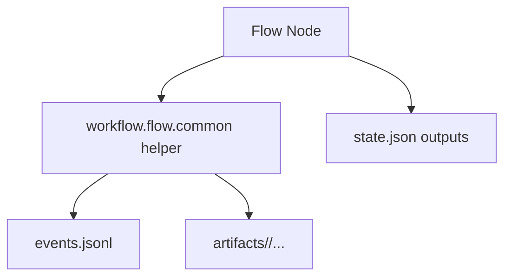

# 变更提案: workflow-node-logging-rollout

## 元信息
```yaml
类型: 优化
方案类型: implementation
优先级: P1
状态: 已确认
创建: 2026-04-22
```

---

## 1. 需求

### 背景
当前工作流已经具备 `events.jsonl` 节点级事件日志和部分工件落盘能力，但不同 flow、不同节点之间的记录粒度不一致。成功路径通常能看到 `prompt.md`、响应 JSON 和部分结果文件，失败路径尤其是“生成后校验失败”“外部抓取失败”“写库失败”等场景，往往只留下事件日志，缺少可直接复盘的原始输入摘要、失败现场和中间产物。

在最近的 `content-create-rewrite` 排障中，这种不一致已经造成实际问题：节点事件可以看出失败发生在第三张图的提示词生成后校验，但失败时没有把该次原始输出落盘，导致证据链不完整。类似问题未来也会出现在其他工作流。

### 目标
- 为所有工作流节点提供统一的日志与工件落盘能力，而不是只覆盖单个 flow。
- 在不改变现有业务流程语义的前提下，补齐失败路径现场快照，提升排障能力。
- 让 LLM 生成节点、抓取节点、出图节点、写库节点都遵循统一的工件命名和事件记录模式。

### 约束条件
```yaml
时间约束: 本次迭代只处理现有 workflow 节点，不扩展到 HTTP 路由和 runtime 之外的系统层
性能约束: 不引入重型日志框架，不显著增加单次节点执行时延
兼容性约束: 保持现有 state.json / events.jsonl 结构继续可读，已有工件路径不失效
业务约束: 不改变各 flow 的业务输入输出和成功/失败判定语义
```

### 验收标准
- [ ] 所有工作流节点均可通过统一 helper 记录输入摘要、阶段事件和工件
- [ ] 成功路径与失败路径都能留下足够的现场快照用于排障
- [ ] `content_create`、`content_collect`、`daily_report` 三条工作流完成接入
- [ ] 关键测试通过，验证公共日志 helper 能在不同节点类型上稳定工作

---

## 2. 方案

### 技术方案
在 `workflow/flow/common.py` 扩展一组通用节点日志 helper，统一处理三类能力：

- 节点输入摘要记录：标准化写入 `input_loaded` 及相关上下文事件
- 阶段快照落盘：为抓取、生成、写库、出图等阶段补充统一的工件写入入口
- 失败现场落盘：在异常、校验失败、软失败等路径下，补充失败原因、原始响应或中间结果的工件保存

接入策略分三层：

- 公共层：抽象命名规范和快照 helper，降低节点内重复代码
- 工作流层：在 `content_create`、`daily_report`、`content_collect` 节点中接入统一 helper
- 验证层：补充针对工件落盘和失败路径的测试，确保成功/失败都能形成稳定证据链

### 影响范围
```yaml
涉及模块:
  - workflow/flow/common.py: 扩展统一日志与工件 helper
  - workflow/flow/content_create/nodes.py: 接入统一节点日志与失败现场快照
  - workflow/flow/content_collect/nodes.py: 接入统一节点日志与失败现场快照
  - workflow/flow/daily_report/nodes.py: 接入统一节点日志与失败现场快照
  - tests/: 增加公共日志能力相关测试
预计变更文件: 6
```

### 风险评估
| 风险 | 等级 | 应对 |
|------|------|------|
| 公共 helper 设计过重，导致节点代码更难读 | 中 | 保持 helper 只负责日志与工件，不吞业务流程 |
| 批量接入时破坏现有工件命名或测试预期 | 中 | 兼容已有文件名，新增失败快照用追加命名 |
| 记录内容过多导致运行目录膨胀 | 低 | 输入摘要优先，原始内容仅在关键阶段或失败时落盘 |

---

## 3. 技术设计（可选）

> 涉及架构变更、API设计、数据模型变更时填写

### 架构设计


### API设计
#### {METHOD} {路径}
- **请求**: {结构}
- **响应**: {结构}

### 数据模型
| 字段 | 类型 | 说明 |
|------|------|------|
| {字段} | {类型} | {说明} |

---

## 4. 核心场景

> 执行完成后同步到对应模块文档

### 场景: 生成节点成功落盘
**模块**: workflow/flow/content_create
**条件**: 节点调用模型并成功得到业务可用结果
**行为**: 记录阶段事件，写入 prompt、结构化结果和阶段快照工件
**结果**: 运行目录中可同时看到事件日志和可复盘的工件

### 场景: 失败路径保留现场
**模块**: workflow/flow/content_collect / workflow/flow/daily_report / workflow/flow/content_create
**条件**: 抓取失败、生成后校验失败、写库失败或软失败
**行为**: 在返回 `blocked` 或 `soft_failed` 前，写入失败原因和已有中间结果快照
**结果**: 即使流程失败，也能直接从工件目录定位根因

---

## 5. 技术决策

> 本方案涉及的技术决策，归档后成为决策的唯一完整记录

### workflow-node-logging-rollout#D001: 统一日志能力在公共层抽象
**日期**: 2026-04-22
**状态**: ✅采纳
**背景**: 多条工作流都存在相似的节点事件记录与工件落盘需求，如果继续在各 flow 内手写，后续会快速分叉。
**选项分析**:
| 选项 | 优点 | 缺点 |
|------|------|------|
| A: 在 `workflow/flow/common.py` 统一抽象 | 复用性强，命名规范统一，后续推广成本低 | 需要一次性改动多个节点 |
| B: 各 flow 单独补日志 | 局部实现简单 | 重复代码多，长期不可维护 |
**决策**: 选择方案 A
**理由**: 本次目标就是“推广到其他工作流”，必须优先控制一致性和后续维护成本。公共层抽象最符合这个目标。
**影响**: 影响所有 flow 节点的日志与工件写入方式，但不改变业务输出

---

## 6. 成果设计

> 含视觉产出的任务由 DESIGN Phase2 填充。非视觉任务整节标注"N/A"。

N/A
