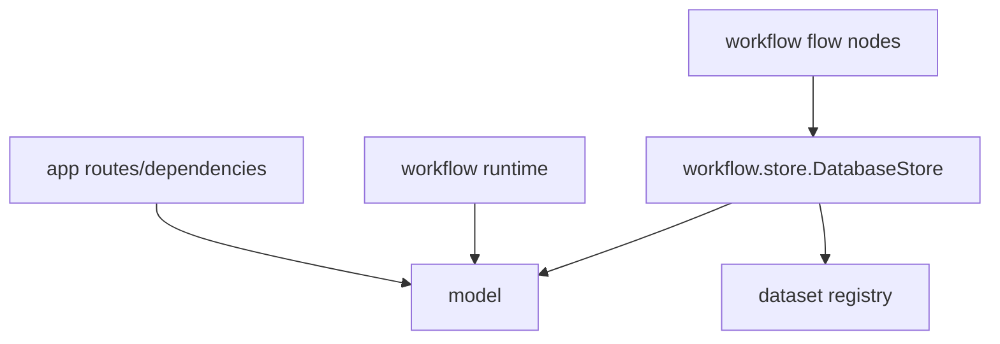

# 变更提案: database-store-model-refactor

## 元信息
```yaml
类型: 重构
方案类型: implementation
优先级: P1
状态: 进行中
创建: 2026-04-23
```

---

## 1. 需求

### 背景
当前 PostgreSQL 相关的数据类型、建表逻辑和 CRUD 全部集中在 `app/model.py`，但该文件已经被 `app`、`workflow/runtime`、脚本和测试共同依赖，职责明显超出 HTTP 层。与此同时，`workflow/store/factory.py` 仍固定返回 `FeishuStore`，流程层虽然有统一的 `Store` 协议，却还没有数据库版 store 实现，导致“飞书 store 改为数据库存储”的落地缺少清晰的分层和入口。

### 目标
- 将 `app/model.py` 一次性迁移为顶层共享 `model/` 目录，明确 `model` 只负责数据库建表和 CRUD。
- 在 `workflow/store/database.py` 内实现 `DatabaseStore`，并内置 dataset registry，供现有 flow 通过统一 `Store` 协议读写数据库。
- 更新导入链路、工厂逻辑和测试，使 `app` 与 `workflow` 共同依赖共享 `model` 层，而不是让 `workflow` 挂靠在 `app` 下。
- 保留现有 `FeishuStore` 作为兼容实现，但让数据库 store 具备可切换的运行路径。

### 约束条件
```yaml
时间约束: 无
性能约束: 不显著增加现有 flow 的读写开销
兼容性约束: 保持现有 Store 协议和主要 HTTP API 结构不变
业务约束: 仅重构分层并接入数据库 store，不改动内容收集/日报/内容创作的业务语义
```

### 验收标准
- [ ] `app/model.py` 的职责迁移到顶层 `model/` 目录，并更新相关导入与测试
- [ ] `model` 层只提供数据库建表与 CRUD，不包含 `Store` 业务语义
- [ ] `workflow/store/database.py` 提供 `DatabaseStore`，并内置 dataset registry
- [ ] `workflow/store/factory.py` 支持基于运行配置选择数据库或飞书 store
- [ ] 相关单元测试通过，至少覆盖 model 导入链路、store 工厂和数据库 store 基本行为

---

## 2. 方案

### 技术方案
- 新建顶层 `model/` 目录，按职责拆分为 `db.py`、`types.py`、`tenant.py`、`schedule.py`、`store_entry.py`，并在 `model/__init__.py` 中统一导出公共符号。
- 将原 `app/model.py` 的租户、飞书配置、schedule 相关逻辑迁移到 `model/`，所有调用点直接改为依赖 `model` 层，不保留兼容壳。
- 为数据库存储新增 `store_entries` 表，采用单表方案承载表格记录和文档内容；底层 CRUD 位于 `model/store_entry.py`。
- 在 `workflow/store/database.py` 中实现 `DatabaseStore`，同时内置 dataset definition、中文名称到 `dataset_key` 的映射、字段列表查询和 doc/table 读写语义。
- 在 `workflow/store/factory.py` 中根据租户运行配置中的 `store_type` 或 store payload 默认值，在 `DatabaseStore` 与 `FeishuStore` 之间切换。

### 影响范围
```yaml
涉及模块:
  - model: 新增共享数据库访问层，承接原 app/model.py 职责
  - app: 导入路径切换为 model 层
  - workflow.store: 新增 DatabaseStore，并调整工厂选择逻辑
  - workflow.runtime: 导入共享 model 层，保持 schedule 运行逻辑
  - tests: 更新补丁路径并增加数据库 store 覆盖
预计变更文件: 14
```

### 风险评估
| 风险 | 等级 | 应对 |
|------|------|------|
| 导入路径一次性迁移导致测试补丁全部失效 | 中 | 统一替换导入并同步更新测试 patch 路径 |
| 单表 store 与现有 flow 的字段约定不一致 | 中 | dataset registry 第一阶段直接沿用现有中文字段名 |
| 工厂切换逻辑影响现有飞书路径 | 低 | 默认继续兼容飞书配置，仅在显式数据库配置时切换 |

---

## 3. 技术设计

> 涉及架构变更与数据模型变更，需明确分层与存储设计

### 架构设计


### 数据模型
| 字段 | 类型 | 说明 |
|------|------|------|
| tenant_id | text | 租户隔离键 |
| dataset_key | text | 逻辑数据集标识 |
| entry_type | text | `row` 或 `doc` |
| record_key | text | 数据集内唯一键 |
| title | text | 预留标题/摘要字段 |
| batch_id | text | 运行批次标识 |
| sort_order | integer | 稳定排序字段 |
| content_text | text | 文档正文内容 |
| payload | jsonb | 表格记录或文档元数据 |
| schema_version | integer | 结构版本号 |
| source_ref | text | 外部来源引用 |
| is_deleted | boolean | 软删除标记 |

---

## 4. 核心场景

> 执行完成后同步到对应模块文档

### 场景: 共享 model 层提供数据库访问
**模块**: model / app / workflow.runtime
**条件**: HTTP 层、调度器或脚本需要访问租户、飞书配置、schedule 或 store entries 数据
**行为**: 统一通过顶层 `model/` 目录中的建表与 CRUD 能力访问 PostgreSQL
**结果**: `app` 与 `workflow` 不再依赖 `app.model` 这一 HTTP 层私有模块

### 场景: workflow 通过 DatabaseStore 读写数据库
**模块**: workflow.store
**条件**: 运行配置声明使用数据库存储
**行为**: `DatabaseStore` 根据 dataset registry 将 `read_table` / `write_table` / `read_doc` / `write_doc` 映射到 `store_entries`
**结果**: 现有 flow 节点无需改动业务逻辑即可读写数据库存储

---

## 5. 技术决策

> 本方案涉及的技术决策，归档后成为决策的唯一完整记录

### database-store-model-refactor#D001: 数据库访问层从 app 中抽离为共享 model 目录
**日期**: 2026-04-23
**状态**: ✅采纳
**背景**: 原 `app/model.py` 已被多个非 app 模块使用，继续保留在 `app/` 下会误导依赖边界，并阻碍数据库 store 的复用。
**选项分析**:
| 选项 | 优点 | 缺点 |
|------|------|------|
| A: 保持 `app/model.py` 不动 | 改动最小 | 分层继续污染，workflow 仍依赖 app 语义 |
| B: 抽为顶层 `model/` 目录 | 共享边界清晰，可承接 store CRUD | 需要一次性更新导入和测试 |
**决策**: 选择方案 B
**理由**: 与“model 层只提供数据库 CRUD，DatabaseStore 放到 workflow”这一已确认分层完全一致。
**影响**: 影响 app、workflow.runtime、scripts 与 tests 的导入路径。

### database-store-model-refactor#D002: 数据库 store 采用单表 `store_entries` + workflow 内置 dataset registry
**日期**: 2026-04-23
**状态**: ✅采纳
**背景**: 当前目标是尽快替换飞书 store，同时保持对现有 flow 的最小侵入。
**选项分析**:
| 选项 | 优点 | 缺点 |
|------|------|------|
| A: 一开始按领域拆多张业务表 | 结构理想、约束强 | 迁移成本高，flow 改动面大 |
| B: 单表存储 + code registry | 落地快，兼容现有 Store 协议 | 后续若高频分析增多需再拆表 |
**决策**: 选择方案 B
**理由**: 当前阶段优先保证切换成本和实现速度，后续可在不破坏 Store 协议的前提下再演进。
**影响**: 新增 `model/store_entry.py` 和 `workflow/store/database.py`，并扩展建表 SQL。

---

## 6. 成果设计

N/A（非视觉任务）
