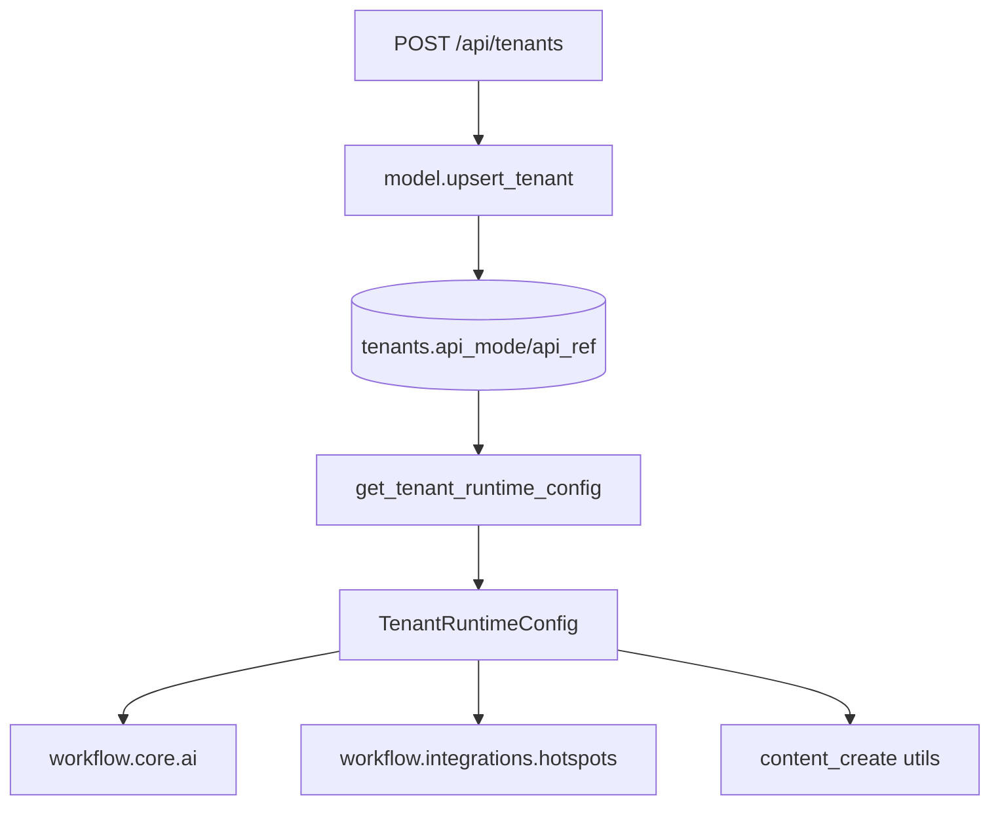

# 变更提案: tenant-api-mode-api-ref

## 元信息
```yaml
类型: 新功能
方案类型: implementation
优先级: P1
状态: 进行中
创建: 2026-04-24
```

---

## 1. 需求

### 背景
当前租户配置仅支持 `api_key`、`default_llm_model`、超时和重试次数。LLM、TikHub 与 Ark 生图能力仍主要依赖系统级环境变量，导致无法按租户隔离第三方凭据与模型配置，也无法明确区分“走系统默认”还是“走租户自定义”。

### 目标
- 为租户增加 `api_mode` 字段，区分系统默认配置与租户自定义配置
- 为租户增加 `api_ref` JSON 字段，仅在 `api_mode=custom` 时存储真实运行配置
- 将 `api_ref` 贯通到运行时，使 LLM、TikHub 和 Ark 生图三条调用链都能按租户配置生效
- 保持现有接口与系统默认环境变量兼容，未启用自定义配置的租户行为不变

### 约束条件
```yaml
时间约束: 无
性能约束: 不增加额外数据库查询次数，仍保持运行前一次性注入
兼容性约束: 现有未传 api_mode/api_ref 的创建接口继续可用，默认走 system
业务约束: 仅 api_mode=custom 时持久化并使用 api_ref；system 模式继续走系统环境变量
```

### 验收标准
- [ ] 租户表支持 `api_mode` 与 `api_ref` 字段，并兼容历史数据迁移
- [ ] 租户创建/查询接口可读写 `api_mode` 与 `api_ref`
- [ ] `get_tenant_runtime_config()` 会将自定义模式下的 `api_ref` 注入运行时配置
- [ ] LLM、TikHub、Ark 生图都能优先读取租户自定义配置；system 模式保持现有环境变量行为
- [ ] 相关单测通过

---

## 2. 方案

### 技术方案
- 在 `tenants` 表新增 `api_mode text not null default 'system'` 与 `api_ref jsonb not null default '{}'::jsonb`
- 扩展 `Tenant` 数据模型、`CreateTenantRequest`/`TenantResponse` 以及 `upsert_tenant()`、`get_tenant_runtime_config()` 读写逻辑
- 在运行时配置中新增统一的 API 访问解析能力，约定 `api_ref` 使用环境变量风格键名，例如 `OPENAI_API_KEY`、`OPENAI_BASE_URL`、`OPENAI_MODEL`、`TIKHUB_API_KEY`、`ARK_API_KEY`
- `api_mode=custom` 时优先读取 `api_ref`；`api_mode=system` 时仍读取系统环境变量
- 调整 `workflow/core/ai.py`、`workflow/integrations/hotspots.py`、`workflow/flow/content_create/utils.py`，统一支持租户级注入配置

### 影响范围
```yaml
涉及模块:
  - model: tenant 持久化与运行时配置注入
  - app: 租户创建/查询接口 schema 与返回结构
  - workflow.core: LLM 运行时配置解析
  - workflow.integrations: TikHub 热点抓取配置解析
  - workflow.flow.content_create: TikHub 抓取与 Ark 生图配置解析
  - tests: 模型、路由与运行时配置测试
预计变更文件: 10
```

### 风险评估
| 风险 | 等级 | 应对 |
|------|------|------|
| 自定义配置字段入库但运行时未真正使用 | 中 | 同步改造 LLM/TikHub/Ark 三条调用链并补测试 |
| 历史租户记录缺少新字段导致读取异常 | 低 | 数据库迁移为新字段设置默认值，模型层兜底 |
| 自定义模式下配置格式不规范 | 中 | schema 约束 `api_mode` 枚举，运行时仅解析字典型 `api_ref` |

---

## 3. 技术设计

### 架构设计


### API设计
#### POST /api/tenants
- **请求**: `tenant_name`、`api_key`、`is_active`、`default_llm_model`、`timeout_seconds`、`max_retries`、`api_mode`、`api_ref`
- **响应**: 返回新增后的 `api_mode` 与 `api_ref`

### 数据模型
| 字段 | 类型 | 说明 |
|------|------|------|
| api_mode | text | `system` 或 `custom`，控制运行时凭据来源 |
| api_ref | jsonb | 自定义模式下的 API 配置字典，键名采用 `OPENAI_API_KEY` 等环境变量风格 |

---

## 4. 核心场景

### 场景: 租户使用系统默认配置
**模块**: model / workflow.core / workflow.integrations
**条件**: 租户 `api_mode=system`
**行为**: 运行时忽略 `api_ref`，继续读取系统环境变量中的 LLM、TikHub、Ark 配置
**结果**: 现有租户行为保持不变

### 场景: 租户使用自定义 API 配置
**模块**: model / workflow.runtime / workflow.core / workflow.flow.content_create
**条件**: 租户 `api_mode=custom` 且 `api_ref` 中包含对应配置
**行为**: 运行时将 `api_ref` 注入 `TenantRuntimeConfig`，LLM、TikHub、Ark 调用优先从租户配置读取
**结果**: 租户可以独立使用自己的 LLM/TikHub/Ark 配置，不影响系统默认配置

---

## 5. 技术决策

> 本方案涉及的技术决策，归档后成为决策的唯一完整记录

### tenant-api-mode-api-ref#D001: 使用统一 `api_mode + api_ref` 承载租户自定义第三方配置
**日期**: 2026-04-24
**状态**: ✅采纳
**背景**: 用户希望租户可显式区分“走系统默认”还是“走自定义”，并使用类似环境变量名的键存储真实配置值。
**选项分析**:
| 选项 | 优点 | 缺点 |
|------|------|------|
| A: 为每个能力分别新增字段 | 类型明确、查询简单 | 字段膨胀快，后续扩展新能力需要继续改表 |
| B: `api_mode + api_ref(JSON)` | 结构统一、易扩展、与环境变量命名兼容 | 运行时需要做统一解析 |
**决策**: 选择方案 B
**理由**: 当前集成点集中在 LLM、TikHub、Ark，统一 JSON 承载既能满足现阶段需求，也能兼容后续增加其他 API 配置项。
**影响**: 影响租户表结构、租户 API schema、运行时配置注入与第三方调用链。

---

## 6. 成果设计

N/A（非视觉任务）
