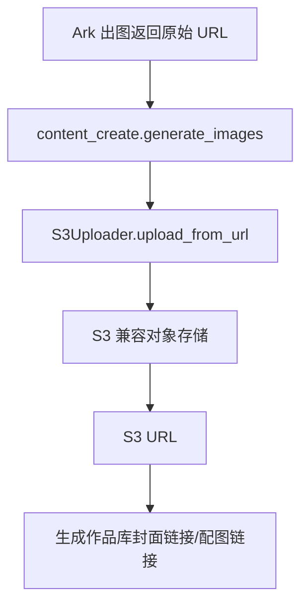

# 变更提案: s3-image-upload

## 元信息
```yaml
类型: 新功能
方案类型: implementation
优先级: P1
状态: 进行中
创建: 2026-04-24
```

---

## 1. 需求

### 背景
当前内容生产流程中的图片生成会直接保存第三方出图服务返回的临时 URL。业务侧需要把这些图片统一转存到自有 S3 存储，避免依赖外部临时链接，同时为后续其他模块复用上传能力提供统一入口。

### 目标
- 增加一个项目内可复用的 S3 上传工具，支持从远程 URL 下载并上传到 S3
- 在 `content_create` 出图完成后，将封面图和配图转存到 S3
- 生成作品库中保存 S3 URL，而不是第三方原始出图 URL
- 保持上传工具接口通用，方便后续其他图片或文件产物复用

### 约束条件
```yaml
时间约束: 无
性能约束: 仅在图片生成完成后串行下载并上传，不改动现有工作流图结构
兼容性约束: 仅接入 AI 生成图片结果，不影响抓取图、参考图和其他外部图片流程
业务约束: 上传能力需抽成通用工具类；S3 配置只读取系统环境变量或项目根目录 `.env`
```

### 验收标准
- [ ] 新增通用 S3 上传工具，支持字节上传和从 URL 下载后上传
- [ ] `generate_images()` 返回的 `cover_url` 和 `image_urls` 改为 S3 URL
- [ ] 上传配置支持系统环境变量和租户 `api_ref` 覆盖
- [ ] 缺少必要 S3 配置时给出明确错误
- [ ] 相关单测与 README 更新完成

---

## 2. 方案

### 技术方案
- 在 `workflow/integrations/` 下新增 S3 上传模块，使用标准库实现 S3 SigV4 PUT 上传，避免新增第三方依赖
- 统一抽象 `S3UploadConfig`、`S3UploadedObject` 与 `S3Uploader`，提供 `upload_bytes()` 和 `upload_from_url()` 两个入口
- 在 `workflow/flow/content_create/utils.py` 中接入该工具：出图后先取第三方 URL，再下载并上传到 S3，最终返回 S3 URL
- 通过 `S3_ENDPOINT`、`S3_REGION`、`S3_BUCKET`、`S3_ACCESS_KEY_ID`、`S3_SECRET_ACCESS_KEY` 等系统配置驱动，不接入租户 `api_ref`

### 影响范围
```yaml
涉及模块:
  - workflow.integrations: 新增通用 S3 上传工具并暴露公共接口
  - workflow.flow.content_create: 出图结果改为上传到 S3 后再写入作品库
  - tests: 新增 S3 配置与出图上传链路测试
  - README / 知识库: 补充 S3 配置说明与模块行为说明
预计变更文件: 9
```

### 风险评估
| 风险 | 等级 | 应对 |
|------|------|------|
| S3 签名实现不兼容目标存储 | 中 | 使用标准 SigV4 路径风格上传，并通过单测覆盖 canonical request/配置逻辑 |
| 上传配置缺失导致出图流程中断 | 中 | 在上传前集中校验配置，抛出清晰错误信息 |
| 转存后 URL 结构不符合业务预期 | 低 | 支持 `S3_PUBLIC_BASE_URL` 与 `S3_KEY_PREFIX`，解耦上传 endpoint 与对外访问 URL |

---

## 3. 技术设计

### 架构设计


### 数据模型
| 字段 | 类型 | 说明 |
|------|------|------|
| endpoint | str | S3 兼容上传地址，例如 `https://s3.amazonaws.com` 或自建对象存储 endpoint |
| region | str | SigV4 使用的 region |
| bucket | str | 目标 bucket |
| access_key_id | str | S3 Access Key |
| secret_access_key | str | S3 Secret Key |
| session_token | str | 可选临时凭证 |
| key_prefix | str | 可选对象前缀 |
| public_base_url | str | 可选公网访问前缀，用于生成最终业务 URL |

---

## 4. 核心场景

> 执行完成后同步到对应模块文档

### 场景: AI 出图后自动转存到 S3
**模块**: `workflow.flow.content_create` / `workflow.integrations`
**条件**: Ark 出图成功且 S3 配置完整
**行为**: `generate_images()` 依次获取每张图片原始 URL，调用通用 S3 上传器下载并上传，最终返回 S3 URL
**结果**: 作品库中的封面链接和配图链接均为自有 S3 地址

### 场景: 后续模块复用上传能力
**模块**: `workflow.integrations`
**条件**: 其他模块持有远程 URL 或原始字节内容
**行为**: 直接调用 `S3Uploader.upload_from_url()` 或 `S3Uploader.upload_bytes()`
**结果**: 复用同一套配置读取、签名上传和 URL 生成逻辑

---

## 5. 技术决策

> 本方案涉及的技术决策，归档后成为决策的唯一完整记录

### s3-image-upload#D001: 使用标准库实现通用 S3 上传能力并在出图后转存
**日期**: 2026-04-24
**状态**: ✅采纳
**背景**: 需要一个可复用的 S3 上传封装，同时不希望为了这次能力引入额外 SDK 依赖或把逻辑散落在业务流程里。
**选项分析**:
| 选项 | 优点 | 缺点 |
|------|------|------|
| A: 直接在 `content_create` 里写死上传逻辑 | 改动快 | 不可复用，业务与存储耦合 |
| B: 引入 `boto3` | 实现成熟 | 新增依赖面，当前项目未使用该 SDK |
| C: 在 `workflow.integrations` 提供标准库版通用 S3 上传器 | 可复用、依赖面小、便于后续复用 | 需要自行实现 SigV4 |
**决策**: 选择方案 C
**理由**: 用户明确要求上传方法抽出来方便复用；同时当前仓库依赖较轻，使用标准库实现更符合现有项目风格。
**影响**: 影响 `workflow.integrations` 公共能力层，以及 `content_create` 出图落库链路。

---

## 6. 成果设计

N/A（非视觉任务）
