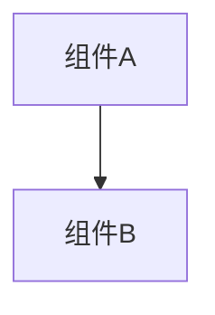

# 变更提案: resume-state-cleanup

## 元信息
```yaml
类型: 修复
方案类型: implementation
优先级: P1
状态: 已确认
创建: 2026-04-24
```

---

## 1. 需求

### 背景
当前 `resume` 能力已经能让失败 run 沿用原 `batch_id` 继续执行，但真实链路验证暴露了两个状态污染问题：

- 恢复成功后，`state.json.messages` 会重复累加历史消息，导致同一成功消息被写入两次。
- 恢复成功后，旧失败态会残留在 `node_statuses` 中，例如异常入口被记录为 `unknown.failed`，即使最终 run 已完成仍不会被清理。

这两个问题会直接影响 run 状态展示、排障判断和外部系统对运行结果的消费。

### 目标
- 修复 `mark_run_finished()` 的最终状态合并逻辑，避免恢复成功后重复追加历史消息或错误。
- 修复 `prepare_resume()` 的恢复前清理逻辑，确保恢复后不会保留上一次失败留下的无效节点状态。
- 为上述两个问题补充最小回归测试，防止后续再次出现同类状态污染。

### 约束条件
```yaml
时间约束: 本次只修复 resume 状态污染，不扩展新的恢复策略
性能约束: 保持现有 state.json 读写模式，不引入额外持久化层
兼容性约束: 不改变现有 resume API、batch_id 复用方式和节点跳过语义
业务约束: 不改动现有 S3/COS 上传与内容创作流程，仅修正运行时状态落盘
```

### 验收标准
- [ ] `resume` 成功结束后，`mark_run_finished()` 不会把已有 `messages/errors` 再次重复追加到最终状态中
- [ ] `prepare_resume()` 后重新完成的 run，不再保留无关的失败节点状态，至少不残留 `unknown.failed`
- [ ] `tests/test_runtime_persistence.py` 覆盖上述两个问题并通过
- [ ] 与本次链路直接相关的 `runtime` / `content_create_images` / `s3_upload` 回归测试通过

---

## 2. 方案

### 技术方案
采用“先补回归测试，再做最小持久化修复”的方式：

- 在 `tests/test_runtime_persistence.py` 中增加两个针对真实问题的测试：
  - 恢复成功后执行 `mark_run_finished()` 不应重复累加旧消息
  - 恢复前后状态转换过程中，不应保留无关失败节点状态
- 在 `workflow/runtime/persistence.py` 中收敛最终态合并语义：
  - `mark_run_finished()` 不再简单用“当前 state + 最终 state patch”方式对 `messages/errors` 做 extend，避免把同一轮运行前已有内容再次叠加
  - `prepare_resume()` 在保留已完成节点信息的同时，清理上一次失败留下的非完成态节点状态，特别是 `failed/running/blocked` 残影
- 保持 `engine.py` 现有恢复入口与节点跳过逻辑不变，避免扩大影响面

### 影响范围
```yaml
涉及模块:
  - workflow/runtime/persistence.py: 修复恢复前状态清理和最终落盘合并逻辑
  - tests/test_runtime_persistence.py: 新增 resume 状态污染回归测试
  - .helloagents/modules/runtime.md: 同步 runtime 的 resume 状态语义
  - .helloagents/CHANGELOG.md: 记录本次修复
预计变更文件: 5
```

### 风险评估
| 风险 | 等级 | 应对 |
|------|------|------|
| 最终态合并逻辑调整误伤普通 run 落盘 | 中 | 先补单测，再只针对 list 合并语义做最小修复 |
| 恢复前清理过度导致已完成节点状态丢失 | 中 | 仅清理非 completed / soft_failed 状态，保留 completed 节点结果 |
| 修复只覆盖单测但未贴近真实链路 | 低 | 回归运行与本次 smoke 直接相关的测试组合，并对真实 state.json 结果做复核 |

---

## 3. 技术设计（可选）

> 涉及架构变更、API设计、数据模型变更时填写

### 架构设计


### API设计
#### {METHOD} {路径}
- **请求**: {结构}
- **响应**: {结构}

### 数据模型
| 字段 | 类型 | 说明 |
|------|------|------|
| {字段} | {类型} | {说明} |

---

## 4. 核心场景

> 执行完成后同步到对应模块文档

### 场景: 失败 run 恢复后完成落盘
**模块**: `workflow.runtime.persistence`
**条件**: 指定 run 曾经失败，随后通过 `resume` 恢复并成功完成
**行为**: repository 在最终 `mark_run_finished()` 时合并当次执行结果并写回完成态
**结果**: `messages/errors` 不重复，run 状态为真实完成结果

### 场景: 恢复前清理旧失败残影
**模块**: `workflow.runtime.persistence`
**条件**: `state.json.node_statuses` 中包含失败节点或 `unknown` 等残留失败状态
**行为**: `prepare_resume()` 清理失败、阻塞、运行中等非完成节点状态，只保留可复用的完成信息
**结果**: 恢复成功后的最终状态不再混入旧失败痕迹

---

## 5. 技术决策

> 本方案涉及的技术决策，归档后成为决策的唯一完整记录

### resume-state-cleanup#D001: 在 repository 内部收敛 resume 状态清理与最终态合并
**日期**: 2026-04-24
**状态**: ✅采纳
**背景**: 问题集中发生在 `StateRepository.prepare_resume()` 和 `mark_run_finished()`，API 与 graph 执行顺序本身已满足需求。
**选项分析**:
| 选项 | 优点 | 缺点 |
|------|------|------|
| A: 在 repository 内最小修复状态清理和最终合并 | 改动集中、风险低、能直接覆盖真实问题 | 需要更明确地区分“patch 合并”和“最终落盘”语义 |
| B: 改造 engine 执行链，重构 resume 状态传递 | 可以统一 run 级状态来源 | 影响面大，超出本次问题范围 |
**决策**: 选择方案 A
**理由**: 当前问题是典型的持久化语义错误，应在状态仓储层直接修正，而不是扩散到 graph runtime。
**影响**: 影响 runtime 状态落盘、resume 恢复一致性和外部状态消费结果

---

## 6. 成果设计

> 含视觉产出的任务由 DESIGN Phase2 填充。非视觉任务整节标注"N/A"。

N/A
